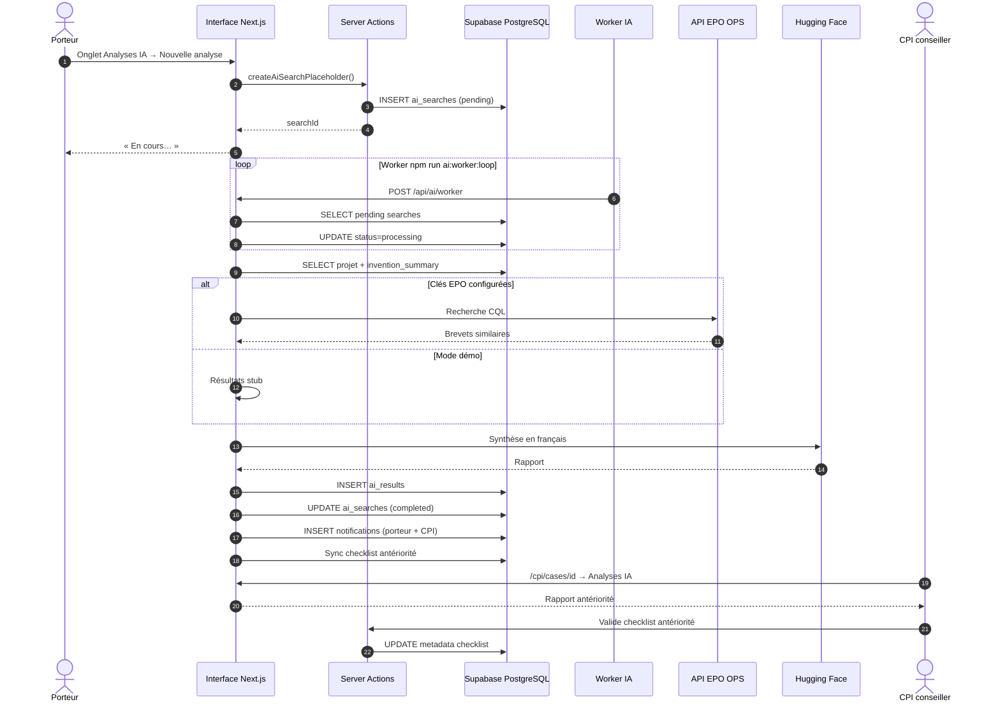
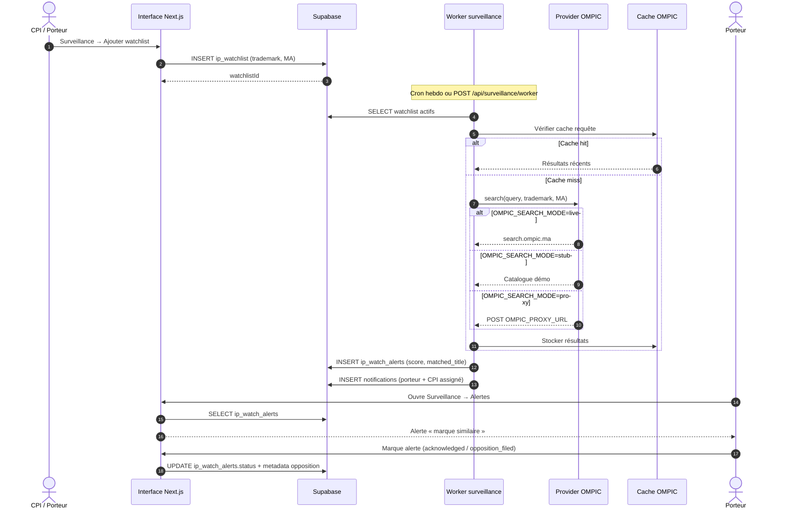
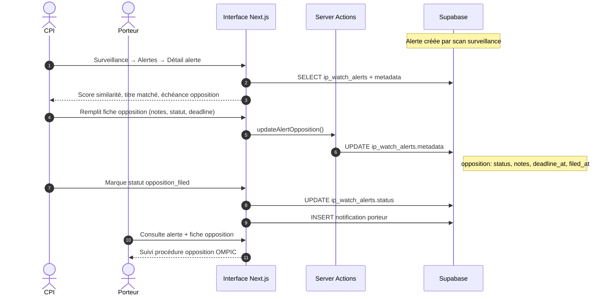
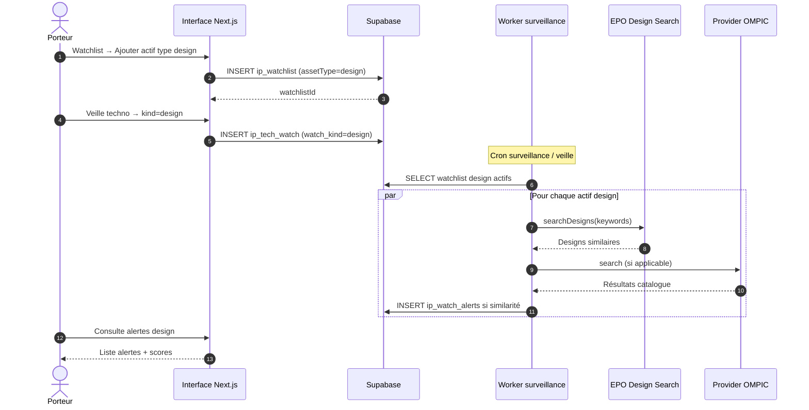
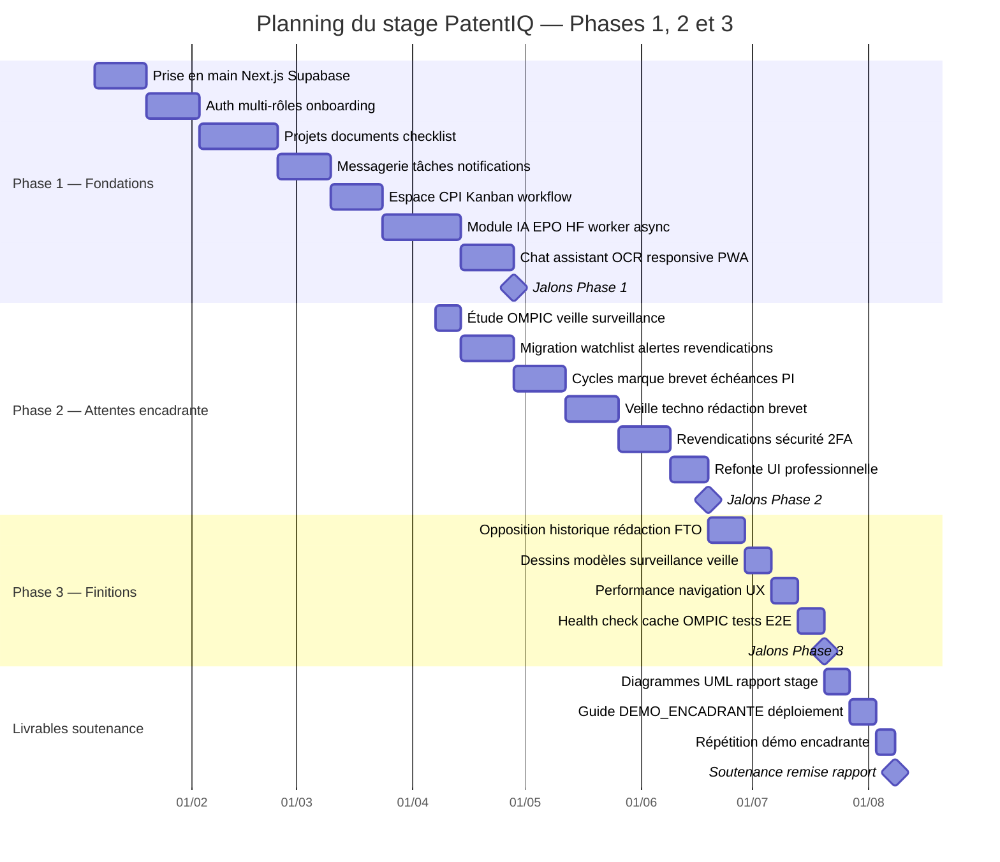
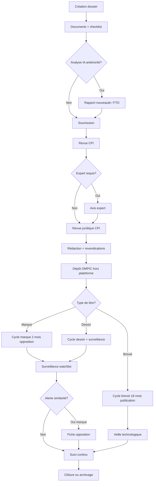

# Diagrammes UML — PatentIQ

Documentation UML pour le rapport de stage : cas d'utilisation, classes, séquences, activité et **planning Gantt**.

**Rendu visuel :** copier un bloc Mermaid dans [Mermaid Live Editor](https://mermaid.live) puis exporter en **PNG** ou **SVG** pour Word / PowerPoint.

**Version :** alignée sur Phase 1 + Phase 2 + Phase 3 (32 migrations, sans module commercialisation).

---

## 1. Diagramme de cas d'utilisation

**Acteurs :** Porteur de projet, Conseiller CPI, Expert, Administrateur, Système externe (OMPIC live/stub/proxy, EPO OPS, Hugging Face).

**Système :** PatentIQ — plateforme web d'assistance PI (contexte OMPIC / Maroc).

```mermaid
flowchart TB
  subgraph PatentIQ["« Système » PatentIQ"]
    direction TB

    subgraph Core["Dossier & collaboration"]
      UC01["UC01 — S'authentifier / confirmer email"]
      UC02["UC02 — Activer 2FA TOTP"]
      UC03["UC03 — Créer un dossier PI"]
      UC04["UC04 — Uploader un document"]
      UC05["UC05 — Remplir la checklist"]
      UC06["UC06 — Échanger via messages"]
      UC07["UC07 — Soumettre le dossier"]
      UC08["UC08 — Consulter les notifications"]
    end

    subgraph IA["Intelligence artificielle"]
      UC09["UC09 — Lancer une analyse IA"]
      UC10["UC10 — Consulter l'historique IA"]
      UC11["UC11 — Utiliser le chat assistant"]
      UC33["UC33 — Analyse FTO liberté d'exploitation"]
    end

    subgraph CPI["Pilotage CPI"]
      UC12["UC12 — Piloter le pipeline Kanban"]
      UC13["UC13 — Changer le statut workflow"]
      UC14["UC14 — Assigner une tâche"]
      UC15["UC15 — Commenter juridiquement"]
      UC16["UC16 — Valider la checklist"]
      UC17["UC17 — Exporter un rapport PDF"]
    end

    subgraph PI["Parcours PI"]
      UC18["UC18 — Rédiger le brevet OMPIC"]
      UC19["UC19 — Éditer les revendications"]
      UC20["UC20 — Piloter cycle marque"]
      UC21["UC21 — Piloter cycle brevet"]
      UC34["UC34 — Consulter historique rédaction"]
    end

    subgraph Surv["Surveillance & veille"]
      UC23["UC23 — Ajouter à la watchlist"]
      UC24["UC24 — Consulter alertes similarité"]
      UC25["UC25 — Configurer veille techno"]
      UC26["UC26 — Recevoir rappels échéances PI"]
      UC35["UC35 — Gérer fiche opposition marque"]
      UC36["UC36 — Surveiller dessin & modèle"]
    end

    subgraph Admin["Administration"]
      UC27["UC27 — Soumettre un avis expert"]
      UC28["UC28 — Gérer les utilisateurs"]
      UC29["UC29 — Consulter l'audit"]
      UC37["UC37 — Vérifier santé système"]
    end

    UC30["UC30 — Stocker les fichiers"]
    UC31["UC31 — Notifier les acteurs"]
    UC32["UC32 — Scanner surveillance / veille"]
  end

  PH((Porteur))
  CPI((Conseiller CPI))
  EXP((Expert))
  ADM((Administrateur))
  EXT((APIs externes))

  PH --> UC01
  PH --> UC02
  PH --> UC03
  PH --> UC04
  PH --> UC05
  PH --> UC06
  PH --> UC07
  PH --> UC08
  PH --> UC09
  PH --> UC10
  PH --> UC11
  PH --> UC18
  PH --> UC19
  PH --> UC20
  PH --> UC21
  PH --> UC23
  PH --> UC24
  PH --> UC25
  PH --> UC26
  PH --> UC33
  PH --> UC34
  PH --> UC36

  CPI --> UC12
  CPI --> UC13
  CPI --> UC14
  CPI --> UC15
  CPI --> UC16
  CPI --> UC17
  CPI --> UC06
  CPI --> UC08
  CPI --> UC18
  CPI --> UC19
  CPI --> UC20
  CPI --> UC21
  CPI --> UC23
  CPI --> UC24
  CPI --> UC25
  CPI --> UC35
  CPI --> UC36

  EXP --> UC27
  EXP --> UC06
  EXP --> UC08

  ADM --> UC28
  ADM --> UC29
  ADM --> UC37

  EXT --> UC32

  UC03 -.->|« include »| UC01
  UC04 -.->|« include »| UC01
  UC09 -.->|« include »| UC01
  UC07 -.->|« include »| UC01
  UC12 -.->|« include »| UC01
  UC04 -.->|« include »| UC30
  UC09 -.->|« include »| UC31
  UC13 -.->|« include »| UC31
  UC23 -.->|« include »| UC32
  UC25 -.->|« include »| UC32
  UC26 -.->|« include »| UC31
  UC09 -.->|« extend »| UC05
  UC13 -.->|« extend »| UC27
  UC35 -.->|« extend »| UC24
  UC36 -.->|« extend »| UC23
```



### Synthèse par acteur

| Acteur | Rôle métier | Cas d'utilisation principaux |
|--------|-------------|------------------------------|
| **Porteur** | Inventeur, startup, chercheur | Dossier, checklist, IA, Parcours PI, surveillance |
| **CPI** | Conseiller PI (OMPIC / Maroc) | Kanban, statuts, juridique, cycles, opposition, veille |
| **Expert** | Spécialiste technique | Avis structuré sur dossiers assignés |
| **Admin** | Gestionnaire plateforme | Utilisateurs, audit, health check |
| **Système externe** | EPO, HF, OMPIC | Recherche brevets/designs, synthèse IA, similarité marques |

---

## 2. Diagramme de classes

Modèle métier — Phase 1 + Phase 2 + Phase 3 (migrations `00001` à `00032`).

```mermaid
classDiagram
    direction TB

    class Profil {
        +UUID id
        +String email
        +String fullName
        +Boolean onboardingCompleted
        +DateTime lastSeenAt
    }

    class Role {
        +AppRole roleName
        +String displayName
    }

    class Projet {
        +UUID id
        +String title
        +String referenceCode
        +ProjectStatus status
        +String inventionSummary
        +Json metadata
        +DateTime lastActivityAt
        +changerStatut()
        +soumettre()
    }

    class Document {
        +UUID id
        +String fileName
        +DocumentStatus status
        +Int versionNumber
    }

    class AnalyseIA {
        +AiSearchType searchType
        +AiSearchStatus status
        +lancer()
        +traiter()
    }

    class ResultatIA {
        +String title
        +Float score
        +String sourceRef
    }

    class Message {
        +String body
        +envoyer()
    }

    class Tache {
        +TaskStatus status
        +TaskPriority priority
        +assigner()
    }

    class Commentaire {
        +String body
        +Boolean isLegal
    }

    class Notification {
        +String title
        +String actionUrl
        +notifier()
    }

    class BrouillonBrevet {
        +String titleField
        +String technicalField
        +String abstractField
        +Json sections
        +suggererIA()
        +sauvegarderVersion()
    }

    class VersionBrouillon {
        +String title
        +String description
        +DateTime createdAt
        +UUID savedBy
    }

    class Revendications {
        +String independentClaim
        +Json dependentClaims
        +editer()
    }

    class Watchlist {
        +IpAssetType assetType
        +String title
        +String territory
        +String logoUrl
        +Date registeredAt
        +Boolean surveillanceActive
        +ajouter()
        +scanner()
    }

    class AlerteSimilarite {
        +Float similarityScore
        +String matchedTitle
        +IpAlertStatus status
        +Json metadata
        +traiter()
        +preparerOpposition()
    }

    class VeilleTechno {
        +TechWatchKind watchKind
        +String keywords
        +String ipcClasses
        +Boolean isActive
        +DateTime lastScanAt
    }

    class CycleMarque {
        +MarqueLifecycleStatus status
        +DateTime oppositionDeadlineAt
        +avancer()
    }

    class CycleBrevet {
        +BrevetLifecycleStatus status
        +DateTime publicationDeadlineAt
        +avancer()
    }

    class SessionChatIA {
        +String title
        +envoyerMessage()
    }

    class AiWorkerService {
        +processPendingSearches()
    }

    class SurveillanceWorker {
        +scanWatchlist()
        +runTechWatch()
        +sendDeadlineReminders()
    }

    class OmpicProvider {
        +searchTrademarks()
        +mode stub|live|proxy|hybrid
    }

    class EpoDesignSearch {
        +searchDesigns()
    }

    class HealthCheck {
        +checkDatabase()
        +checkStorage()
        +checkEnv()
    }

    Profil "1" --> "*" Projet : possède
    Projet "1" --> "*" Document
    Projet "1" --> "*" AnalyseIA
    AnalyseIA "1" --> "*" ResultatIA
    Projet "1" --> "*" Message
    Projet "1" --> "*" Tache
    Projet "1" --> "*" Commentaire
    Projet "0..1" --> "1" BrouillonBrevet
    BrouillonBrevet "1" --> "*" VersionBrouillon
    Projet "0..1" --> "1" Revendications
    Projet "1" --> "*" Watchlist
    Watchlist "1" --> "*" AlerteSimilarite
    Profil "1" --> "*" VeilleTechno
    Projet "1" --> "*" SessionChatIA
    Projet ..> CycleMarque : metadata
    Projet ..> CycleBrevet : metadata
    Profil "1" --> "*" Notification

    AiWorkerService ..> AnalyseIA : traite
    SurveillanceWorker ..> Watchlist : scanne
    SurveillanceWorker ..> VeilleTechno : scanne
    SurveillanceWorker ..> AlerteSimilarite : crée
    OmpicProvider ..> Watchlist : alimente
    EpoDesignSearch ..> Watchlist : designs
```



### Correspondance tables Supabase

| Classe UML | Table PostgreSQL |
|------------|------------------|
| Profil | `profiles` |
| Projet | `projects` |
| Document | `documents` / `document_versions` |
| AnalyseIA / ResultatIA | `ai_searches` / `ai_results` |
| SessionChatIA | `ai_chat_sessions` / `ai_chat_messages` |
| Message | `messages` |
| Tache | `project_tasks` |
| Commentaire | `project_comments` |
| Notification | `notifications` |
| BrouillonBrevet | `patent_drafts` |
| VersionBrouillon | `patent_draft_versions` |
| Revendications | `patent_claims_drafts` |
| Watchlist | `ip_watchlist` |
| AlerteSimilarite | `ip_watch_alerts` |
| VeilleTechno | `ip_tech_watch` |
| CycleMarque / CycleBrevet | `projects.metadata` (JSON) |

**Types enum notables :**

| Enum | Valeurs |
|------|---------|
| `IpAssetType` | `trademark`, `patent`, `design` |
| `TechWatchKind` | `patent`, `design` |
| `AiSearchType` | `novelty`, `prior_art`, `fto`, … |
| `IpAlertStatus` | `new`, `acknowledged`, `opposition_filed`, `dismissed` |

### Workflow projet (états)

```
draft → submitted → in_review → awaiting_documents
  → expert_review → cpi_review → approved | rejected → closed
```

### Cycle marque OMPIC

```
depose → publie (2 mois) → opposition_ouverte → enregistre → surveillance_active
```

### Cycle brevet OMPIC

```
depose → examen → en_attente_publication (18 mois) → publie → accorde → surveillance_active
```

---

## 3. Diagramme de séquence — Analyse IA (antériorité)

**Scénario :** le porteur lance une analyse de nouveauté brevet.



---

## 4. Diagramme de séquence — Surveillance marque (OMPIC)

**Scénario :** scan watchlist et alerte de similarité (mode live, stub ou proxy OMPIC).



---

## 5. Diagramme de séquence — Opposition marque

**Scénario :** alerte de similarité → fiche opposition (fenêtre 2 mois).



---

## 6. Diagramme de séquence — Surveillance dessin & modèle

**Scénario :** ajout d'un actif `design` à la watchlist + veille EPO designs.



---

## 7. Diagramme de Gantt — Planning du stage

**À adapter :** remplacer les dates par vos dates réelles de stage.  
Exporter via [Mermaid Live Editor](https://mermaid.live) pour insertion dans le rapport.



### Tableau récapitulatif du Gantt (alternative Word)

| Période | Lot | Livrables |
|---------|-----|-----------|
| Sem. 1–2 | Phase 1 — Setup | Environnement, auth, rôles |
| Sem. 3–5 | Phase 1 — Dossier | Documents, checklist, messages |
| Sem. 6–7 | Phase 1 — CPI | Kanban, statuts, notifications |
| Sem. 8–10 | Phase 1 — IA | EPO OPS, HF, worker, chat |
| Sem. 11–12 | Phase 2 — Surveillance | Watchlist, alertes, OMPIC live/stub |
| Sem. 13–14 | Phase 2 — Workflows PI | Cycles marque/brevet, échéances |
| Sem. 15–16 | Phase 2 — Rédaction & veille | Brevet, revendications, veille techno |
| Sem. 17 | Phase 2 — Sécurité & UI | 2FA, interface pro |
| Sem. 18–19 | Phase 3 — Crédibilité | Opposition, FTO, historique rédaction |
| Sem. 20–21 | Phase 3 — Extension | Dessins & modèles, perf, E2E |
| Sem. 22–24 | Livrables | UML, rapport, démo, soutenance |

---

## 8. Diagramme d'activité — Parcours dossier (simplifié)



---

## 9. Diagramme de composants — Architecture (vue d'ensemble)

```mermaid
flowchart TB
    subgraph Client["Navigateur"]
        UI[React / Next.js App Router]
    end

    subgraph Server["Next.js serveur"]
        MW[Middleware Auth]
        SA[Server Actions]
        API[Route Handlers API]
        HC[/api/health]
    end

    subgraph Data["Supabase"]
        PG[(PostgreSQL + RLS)]
        ST[Storage documents]
        AUTH[Auth + 2FA]
    end

    subgraph Workers["Workers arrière-plan"]
        AIW[Worker IA]
        SVW[Worker surveillance]
        CRON[Cron GitHub Actions]
    end

    subgraph External["APIs externes"]
        EPO[EPO OPS + Designs]
        HF[Hugging Face]
        OMPIC[OMPIC live/stub/proxy]
    end

    UI --> MW --> SA
    UI --> API
    SA --> PG
    SA --> ST
    API --> PG
    API --> AIW
    API --> SVW
    CRON --> SVW
    AIW --> EPO
    AIW --> HF
    SVW --> OMPIC
    SVW --> EPO
    HC --> PG
    HC --> ST
    MW --> AUTH
```

---

## Utilisation dans le rapport de stage

| Diagramme | Chapitre suggéré | Phrase d'introduction |
|-----------|------------------|------------------------|
| Cas d'utilisation | Besoins fonctionnels | *PatentIQ couvre le dossier collaboratif, le Parcours PI et la surveillance post-dépôt pour marque, brevet et dessin.* |
| Classes | Conception / Modèle de données | *Le projet central agrège documents, IA, watchlist, rédaction et alertes d'opposition.* |
| Séquence IA | Traitement antériorité | *L'analyse est asynchrone via worker et APIs EPO / Hugging Face.* |
| Séquence surveillance | Module OMPIC | *La watchlist déclenche des alertes via un provider configurable (live/stub/proxy).* |
| Séquence opposition | Surveillance marque | *Une alerte peut déclencher une fiche opposition structurée dans la fenêtre de 2 mois.* |
| Séquence dessin | Extension Phase 3 | *Les dessins & modèles suivent un parcours de surveillance et veille distinct.* |
| Gantt | Organisation du stage | *Le planning distingue Phase 1 (socle), Phase 2 (encadrante) et Phase 3 (finitions).* |
| Activité | Parcours métier | *Le flux illustre la divergence marque / brevet / dessin après le dépôt.* |
| Composants | Architecture technique | *L'architecture sépare UI, Server Actions, workers et APIs externes.* |

---

## Procédure d'export pour Word

1. Ouvrir [https://mermaid.live](https://mermaid.live)
2. Copier **un bloc** ` ```mermaid ... ``` ` (sans les backticks externes)
3. Ajuster si besoin (zoom, thème)
4. **Actions → Export PNG** ou **SVG**
5. Insérer l'image dans Word sous le titre du diagramme
6. Répéter pour chaque diagramme (7 à 9 images selon le rapport)

**Conseil rapport :** inclure au minimum les diagrammes **1, 2, 4, 7 et 8** — les plus attendus en soutenance PI + informatique.

---

## Références

- Schéma BDD : [`SCHEMA_REFERENCE.md`](./SCHEMA_REFERENCE.md)
- Surveillance OMPIC : [`OMPIC_SURVEILLANCE.md`](./OMPIC_SURVEILLANCE.md)
- Veille & FTO : [`VERDICT_J_VEILLE_FTO.md`](./VERDICT_J_VEILLE_FTO.md)
- Fournisseurs IA : [`AI_PROVIDERS.md`](./AI_PROVIDERS.md)
- Démo encadrante : [`DEMO_ENCADRANTE.md`](./DEMO_ENCADRANTE.md)
- Roadmap : [`ROADMAP_ATTENTES_ENCADRANTE.md`](./ROADMAP_ATTENTES_ENCADRANTE.md)
- Rapport stage : [`RAPPORT_STAGE.md`](./RAPPORT_STAGE.md)
