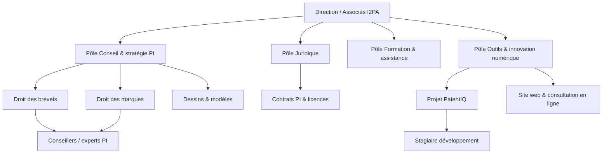

# Rapport de stage — Modèle officiel (PatentIQ / I2PA)

> **Document de structure** à suivre pour la rédaction finale (Word / PDF).  
> Contenu détaillé existant : [`RAPPORT_STAGE_REDACTION.md`](./RAPPORT_STAGE_REDACTION.md) · Diagrammes : [`DIAGRAMMES_UML.md`](./DIAGRAMMES_UML.md)  
> Remplacez tous les champs `[À COMPLÉTER]`.

---

## Pages préliminaires

### Page de garde

```
[Prénom NOM]
[N° étudiant · Promotion · Filière]
[Nom de l'établissement]

RAPPORT DE STAGE

Conception et développement de PatentIQ,
plateforme web d'assistance à la propriété intellectuelle

Stage réalisé du [JJ/MM/AAAA] au [JJ/MM/AAAA]
Durée : [X] semaines

Structure d'accueil :
I2PA — International Intellectual Property Assistance
Lot Massira, Rés. Costa del Sol, Mohammedia, Maroc
https://i2pa.com/

Encadrante entreprise : [Prénom NOM, fonction]
Tuteur pédagogique : [Prénom NOM, établissement]

Année universitaire [2025–2026]
```

### Remerciements

→ Reprendre la section **Remerciements** de [`RAPPORT_STAGE_REDACTION.md`](./RAPPORT_STAGE_REDACTION.md).

### Résumé (français)

→ Reprendre la section **Résumé** de [`RAPPORT_STAGE_REDACTION.md`](./RAPPORT_STAGE_REDACTION.md).  
**Mots-clés :** propriété intellectuelle, OMPIC, brevet, marque, Next.js, Supabase, IA, surveillance, veille technologique.

### Abstract (anglais)

Traduction du résumé (150–250 mots). Exemple d'ouverture :

> During my internship at I2PA (International Intellectual Property Assistance, Morocco), I contributed to the development of **PatentIQ**, a full-stack web platform that centralizes intellectual property case management…

### Liste des acronymes

| Acronyme | Signification |
|----------|---------------|
| CPI | Conseiller en propriété industrielle |
| EPO | European Patent Office |
| FTO | Freedom to Operate (liberté d'exploitation) |
| HF | Hugging Face |
| IA / LLM | Intelligence artificielle / Large Language Model |
| I2PA | International Intellectual Property Assistance |
| IPC | International Patent Classification |
| OMPIC | Office marocain de la propriété industrielle et commerciale |
| PI | Propriété intellectuelle |
| RAG | Retrieval-Augmented Generation |
| RLS | Row Level Security |
| TRL | Technology Readiness Level |
| UI/UX | Interface / expérience utilisateur |

### Liste des figures

| N° | Titre | Chapitre |
|----|-------|----------|
| Figure 1 | Organigramme fonctionnel I2PA | Ch. 1 |
| Figure 2 | Parcours PI marque vs brevet (OMPIC) | Ch. 2 |
| Figure 3 | Diagramme de cas d'utilisation PatentIQ | Ch. 3 |
| Figure 4 | Architecture générale (Next.js + Supabase) | Ch. 3 |
| Figure 5 | Modèle de données (diagramme de classes) | Ch. 3 |
| Figure 6 | Séquence — analyse IA antériorité | Ch. 4 |
| Figure 7 | Séquence — surveillance OMPIC | Ch. 4 |
| Figure 8 | Captures d'écran démo (porteur / CPI) | Ch. 5 |
| Figure 9 | Diagramme de Gantt du stage | Annexe |

### Liste des tableaux

| N° | Titre | Chapitre |
|----|-------|----------|
| Tableau 1 | Coordonnées et identité I2PA | Ch. 1 |
| Tableau 2 | Gamme de services I2PA | Ch. 1 |
| Tableau 3 | Comparaison solutions existantes | Ch. 2 |
| Tableau 4 | Acteurs et rôles PatentIQ | Ch. 3 |
| Tableau 5 | Besoins fonctionnels / non fonctionnels | Ch. 3 |
| Tableau 6 | Stack technique | Ch. 4 |
| Tableau 7 | Résultats des tests | Ch. 6 |

### Table des matières

Générée automatiquement dans Word à partir des titres ci-dessous.

---

# Introduction générale

## Contexte

La propriété intellectuelle au Maroc implique l'**OMPIC**, des délais distincts selon le type de titre (marque ~2 mois d'opposition, brevet ~18 mois avant publication), et une collaboration étroite entre porteur de projet et conseiller PI. Les outils généralistes (email, cloud) ne structurent pas ce parcours.

## Problématique (aperçu)

Comment **digitaliser le suivi opérationnel** d'un dossier PI au sein d'un cabinet comme I2PA, sans remplacer les portails officiels (directompic.ma), tout en intégrant l'IA de manière transparente et traçable ?

## Objectifs du stage

1. Comprendre le parcours porteur / CPI / expert au Maroc ;
2. Développer **PatentIQ** : collaboration, documents, checklist, IA, surveillance ;
3. Aligner les livrables sur les attentes métier de l'encadrante ;
4. Documenter, tester et préparer la démonstration de soutenance.

## Méthodologie

Approche **incrémentale** : migrations SQL, Server Actions et composants livrés par itérations courtes, validées en double session (porteur + CPI). Roadmap : [`ROADMAP_ATTENTES_ENCADRANTE.md`](./ROADMAP_ATTENTES_ENCADRANTE.md).

| Phase | Période | Objectif |
|-------|---------|----------|
| Phase 1 | Sem. 1–10 | Socle collaboratif + IA |
| Phase 2 | Sem. 11–21 | Surveillance, rédaction, cycles PI |
| Phase 3 | Sem. 22–24 | Finitions UX, robustesse, E2E |

## Plan du rapport

| Chapitre | Contenu |
|----------|---------|
| **Ch. 1** | Présentation de l'entreprise d'accueil (I2PA) |
| **Ch. 2** | Contexte projet, existant, cahier des charges |
| **Ch. 3** | Besoins, acteurs, conception |
| **Ch. 4** | Réalisation et implémentation |
| **Ch. 5** | Intelligence artificielle et valorisation des données |
| **Ch. 6** | Tests, résultats, perspectives |

---

# Chapitre 1 — Présentation de l'entreprise

> **Chapitre dédié** à l'organisme d'accueil, distinct du contexte projet (Ch. 2).  
> Sources : [i2pa.com](https://i2pa.com/), observations de stage, échanges avec l'encadrante.

## 1.1 Identité et positionnement

**I2PA** — *International Intellectual Property Assistance* — est une structure d'assistance et de conseil en **propriété intellectuelle**, basée au **Maroc**. Son slogan public est : *« Protéger, valoriser, innover »*. Sur son site, I2PA se présente comme un **expert en propriété intellectuelle**, orienté protection durable des actifs immatériels et valorisation stratégique des innovations.

L'entreprise s'adresse aux **entreprises, startups, inventeurs et créateurs**, au niveau **national et international**, avec une démarche **sur mesure**, **proactive** et **rigoureuse**.

**Tableau 1 — Coordonnées publiques I2PA**

| Information | Détail |
|-------------|--------|
| Raison sociale | I2PA — International Intellectual Property Assistance |
| Adresse | Lot Massira, Résidence Costa del Sol, **Mohammedia**, Maroc |
| Site web | [https://i2pa.com/](https://i2pa.com/) |
| Téléphone | (+212) 615 539 752 |
| E-mail | Contact@i2pa.com |
| Horaires | Lundi – Vendredi, 09h00 – 18h00 |

I2PA n'est **pas** un office de dépôt : ce rôle relève de l'**OMPIC** et des portails officiels (**directompic.ma**). I2PA est un **cabinet d'assistance** qui accompagne le client avant, pendant et après les démarches officielles.

## 1.2 Historique et évolution

Le site [i2pa.com](https://i2pa.com/) ne publie pas de chronologie détaillée de fondation. La communication met en avant :

- une expertise construite autour du **droit marocain de la PI** ;
- une intervention **nationale et internationale** ;
- un réseau de **partenaires juridiques** à l'étranger.

Les témoignages clients (brevets, marques au Maroc, contrats de licence) illustrent une activité orientée **conseil + exécution** des démarches PI, plutôt qu'un simple courtage administratif.

## 1.3 Missions, vision et valeurs

**Missions** (page [À propos](https://i2pa.com/a-propos)) :

1. **Protéger** les actifs immatériels (brevets, marques, dessins et modèles, droits d'auteur, contrats) ;
2. **Valoriser** le capital intellectuel (stratégie, licensing, croissance) ;
3. **Défendre** les intérêts des porteurs de droits (veille, surveillance, contentieux).

**Vision :** *« Sécuriser l'innovation, stimuler la croissance »*.

**Valeurs mises en avant :** expertise juridique, conseil personnalisé, veille concurrentielle, accompagnement adapté (startup, PME, grand groupe).

## 1.4 Activités et services

**Tableau 2 — Gamme de services I2PA**

| Domaine | Contenu |
|---------|---------|
| Formation, expertise et assistance | Montée en compétence clients sur la PI |
| Droit des brevets | Dépôt, rédaction, stratégie inventions |
| Droit des dessins et modèles | Protection de l'apparence des produits |
| Droit des marques | Dépôt, surveillance, défense des signes |
| IG & appellations d'origine | Protection produits territoriaux |
| E-datage | Preuve de date et sécurisation |
| Droit d'auteur | Protection des œuvres |
| Contrats PI | Licences, cession, partenariats |
| Patrimoine marocain | Valorisation et défense du patrimoine national |

I2PA propose aussi une **consultation en ligne** (« Plan I2PA Personnalisé »), signe d'une **digitalisation du premier contact** client.

## 1.5 Organisation de l'entreprise

Le site ne publie pas d'organigramme officiel. Structure **fonctionnelle plausible** (à valider avec l'encadrante) :

**Figure 1 — Organigramme fonctionnel I2PA**



**Quatre pôles :**

1. **Conseil et stratégie PI** — pilotage dossiers, coordination OMPIC ;
2. **Juridique** — revendications, contrats, conformité ;
3. **Formation et assistance** — formation, e-datage ;
4. **Outils et innovation numérique** — site web, **PatentIQ**.

## 1.6 Service d'accueil du stagiaire

| Aspect | Description |
|--------|-------------|
| **Pôle** | Outils numériques / innovation, rattaché au conseil PI |
| **Encadrante** | Profil CPI — retours terrain OMPIC, marque vs brevet |
| **Objectif stage** | Concevoir et développer **PatentIQ** |
| **Livrables** | Application web, documentation, démo, UML, rapport |
| **Lien I2PA** | Prolongement numérique de la mission *protéger, valoriser, innover* |

Le nom **PatentIQ** (« IQ » = intelligence / qualité du dossier) reflète l'ambition : rigueur du conseil PI + apport de l'**IA** sous responsabilité du CPI.

## 1.7 Conclusion du chapitre

I2PA est un cabinet marocain d'assistance PI, ancré à **Mohammedia**, actif sur brevets, marques, dessins, contrats et services complémentaires. Sa proximité avec l'écosystème **OMPIC** et sa volonté de digitalisation en font un cadre pertinent pour le projet **PatentIQ**, développé au sein du pôle innovation numérique.

---

# Chapitre 2 — Contexte du projet et analyse de l'existant

## 2.1 Présentation du contexte

→ Développer : [`RAPPORT_STAGE_REDACTION.md` § Chapitre 2](./RAPPORT_STAGE_REDACTION.md) — PI au Maroc, OMPIC, directompic, spécificité marque/brevet/dessin.

## 2.2 Rappel sur l'organisme d'accueil

Renvoi au **Chapitre 1** (I2PA). Ici : uniquement le **lien entre l'activité I2PA et le besoin PatentIQ**.

## 2.3 Problématique

- Fragmentation des échanges (email, cloud, notes personnelles) ;
- Absence de traçabilité des étapes PI ;
- Non-différenciation marque / brevet dans les outils génériques ;
- Surveillance et veille peu industrialisées ;
- Risques de confidentialité avant dépôt ;
- Écart entre vitrine web (i2pa.com) et suivi opérationnel dossier.

## 2.4 Analyse de l'existant

### Pratiques métier I2PA

→ [`RAPPORT_STAGE_REDACTION.md` § 1.4](./RAPPORT_STAGE_REDACTION.md)

### Outils informatiques avant PatentIQ

| Outil | Usage | Limite |
|-------|-------|--------|
| Email | Échanges porteur ↔ CPI | Fil non structuré |
| Drive / local | PDF | Versions floues |
| Espacenet | Antériorité | Non lié au dossier |
| OMPIC / directompic | Dépôt officiel | Hors collaboration |
| Tableurs | Échéances | Pas de lien statut dossier |

## 2.5 Étude comparative des solutions existantes

→ [`RAPPORT_STAGE_REDACTION.md` § Chapitre 3](./RAPPORT_STAGE_REDACTION.md) — Espacenet, Google Patents, directompic, outils cabinets étrangers, limites pour le contexte marocain.

## 2.6 Critique de l'existant

→ [`RAPPORT_STAGE_REDACTION.md` § 1.5](./RAPPORT_STAGE_REDACTION.md) — 7 faiblesses identifiées avec l'encadrante.

## 2.7 Cahier des charges

**Objectif :** plateforme web multi-rôles pour préparer et suivre un dossier PI (sans remplacer OMPIC).

**Fonctionnel :** projets par catégorie, documents, checklist, messagerie, tâches, IA antériorité, assistant, surveillance OMPIC, veille techno, rédaction brevet, revendications, cycles marque/brevet, export dossier.

**Non fonctionnel :** sécurité (RLS, 2FA), responsive, français métier, worker IA fiable, mode OMPIC configurable.

**Contraintes :** pas d'API OMPIC REST officielle ; IA gratuite (HF) avec fallbacks ; hébergement Vercel + Supabase.

## 2.8 Conclusion du chapitre

L'existant justifie **PatentIQ** : centraliser collaboration, traçabilité et surveillance dans un outil aligné I2PA / OMPIC.

---

# Chapitre 3 — Analyse des besoins et conception

## 3.1 Analyse des besoins fonctionnels

→ Parcours porteur, CPI, expert, admin — [`RAPPORT_STAGE_REDACTION.md` § Ch. 4](./RAPPORT_STAGE_REDACTION.md)

## 3.2 Analyse des besoins non fonctionnels

Performance, sécurité, disponibilité, maintenabilité, accessibilité mobile, traçabilité audit.

## 3.3 Identification des acteurs

| Acteur | Rôle |
|--------|------|
| Porteur de projet | Crée le dossier, dépose documents, lance analyses |
| CPI | Revue, statuts, tâches, surveillance, rédaction |
| Expert métier | Avis technique structuré (revue expert) |
| Admin | Utilisateurs, assignations, santé système |

## 3.4 Modélisation des processus

- Workflow statuts projet ;
- Cycle vie marque (2 mois opposition) ;
- Cycle vie brevet (18 mois publication) ;
- Flux worker IA et surveillance hebdo.

## 3.5 Conception fonctionnelle

Modules : auth, projets, documents, checklist, échanges, CPI/Kanban, IA, surveillance, veille, Parcours PI.

## 3.6 Conception technique

Next.js 14 App Router, Server Actions, Supabase, API routes workers.

## 3.7 Conception de la base de données

32 migrations PostgreSQL, RLS, Storage — schéma dans [`DIAGRAMMES_UML.md`](./DIAGRAMMES_UML.md).

## 3.8 Architecture générale de la solution

**Figure 4** — Client Next.js ↔ Supabase (Auth, DB, Storage) ↔ APIs externes (EPO OPS, Hugging Face, OMPIC live/proxy).

## 3.9 Conclusion du chapitre

→ [`RAPPORT_STAGE_REDACTION.md` § Ch. 5](./RAPPORT_STAGE_REDACTION.md)

---

# Chapitre 4 — Réalisation et implémentation

## 4.1 Environnement de développement

Node.js, VS Code / Cursor, Git, Supabase CLI, comptes démo porteur/CPI.

## 4.2 Technologies utilisées

| Couche | Technologie |
|--------|-------------|
| Frontend | Next.js 14, React, TypeScript, Tailwind, shadcn/ui |
| Backend | Server Actions, API Routes |
| Données | Supabase PostgreSQL + RLS + Storage |
| IA | EPO OPS, Hugging Face, PDFKit, Tesseract.js (OCR) |
| Tests | Vitest, Playwright |
| CI | GitHub Actions (worker IA, surveillance) |

## 4.3 Architecture technique

Structure `src/app`, `src/lib`, `src/components` — voir README.

## 4.4 Développement des fonctionnalités

→ Détail complet : [`RAPPORT_STAGE_REDACTION.md` § Ch. 6](./RAPPORT_STAGE_REDACTION.md)

- Phase 1 : auth, projets, documents, checklist, messagerie, Kanban CPI, IA ;
- Phase 2 : surveillance OMPIC, veille, rédaction, revendications, cycles PI, 2FA ;
- Phase 3 : opposition, dessins & modèles, export ZIP, robustesse.

## 4.5 Intégration des composants

Workers async, notifications, checklist auto, toasts utilisateur, health check.

## 4.6 Conclusion du chapitre

Application déployable sur Vercel avec Supabase cloud ; documentation `WORKER_AND_DEPLOY.md`, `DEMO_ENCADRANTE.md`.

---

# Chapitre 5 — Intelligence artificielle et valorisation des données

> Chapitre **obligatoire** pour une filière IA.

## 5.1 Présentation de l'approche IA

IA **assistive** (pas de remplacement du CPI) : antériorité, synthèse, chat contextuel, brouillon brevet, résumé veille.

## 5.2 Collecte et préparation des données

- Texte invention, documents PDF (OCR), métadonnées projet ;
- Résultats EPO OPS / OMPIC ;
- Chunks documents pour RAG (`document-rag.ts`).

## 5.3 Méthodologie adoptée

- Recherche brevets : API **EPO OPS** (CQL) ;
- Synthèse : **LLM Hugging Face** (Qwen2.5-7B-Instruct) ;
- Worker asynchrone + fallbacks template / quota ;
- RAG léger par mots-clés (sans embeddings).

## 5.4 Développement et « entraînement » du modèle

**Pas de fine-tuning** : utilisation de modèles pré-entraînés via API. Prompt engineering + contexte dossier enrichi.

## 5.5 Évaluation des performances

→ [`docs/AI_EVAL_CASES.md`](./AI_EVAL_CASES.md) — 5 cas documentés ; métriques admin (analyses 24 h, fallbacks HF).

## 5.6 Intégration dans la solution

Panneau analyses IA, chat assistant, générateur brouillon, badges confiance, sources Espacenet/OMPIC, export PDF analyses dans ZIP dossier.

## 5.7 Conclusion du chapitre

L'IA apporte de la valeur si elle est **transparente** (sources, confiance, fallbacks) et **cadrée** par le métier PI.

---

# Chapitre 6 — Tests, résultats et perspectives

## 6.1 Stratégie de tests

- **Unitaires** : Vitest (~96 tests) — similarity, OMPIC cache, RAG, export ZIP… ;
- **E2E** : Playwright — parcours démo marque/brevet ;
- **Manuel** : double session porteur + CPI, scénario encadrante.

## 6.2 Validation fonctionnelle

Checklist [`DEMO_PREP_PRIORITE1.md`](./DEMO_PREP_PRIORITE1.md), mapping [`ATTENTES_ENCADRANTE_MAPPING.md`](./ATTENTES_ENCADRANTE_MAPPING.md).

## 6.3 Analyse des résultats

Fonctionnalités Phase 1–3 livrées ; OMPIC live sensible au portail public ; worker IA nécessite cron ou terminal local.

## 6.4 Limites de la solution

Pas d'API OMPIC officielle ; similarité logo absente ; expert peu intégré au workflow ; emails transactionnels non configurés (pas de domaine).

## 6.5 Perspectives d'amélioration

Embeddings vectoriels, similarité image marques, tâches expert + clôture mission, emails résumé CPI, chiffrement revendications.

## 6.6 Conclusion du chapitre

PatentIQ atteint un MVP crédible pour démo I2PA ; la suite = fiabilité prod et profondeur métier marque.

---

# Conclusion générale

Synthèse en 3 axes :

1. **Entreprise** — I2PA, cabinet PI marocain ; PatentIQ prolonge sa digitalisation ;
2. **Technique** — stack moderne, 32 migrations, IA intégrée, tests automatisés ;
3. **Personnel** — montée en compétence PI + full-stack + IA appliquée.

Phrase de clôture type soutenance :

> *« PatentIQ structure la préparation et le suivi d'un dossier PI pour I2PA : collaboration multi-acteurs, antériorité assistée, surveillance OMPIC et veille techno — le dépôt officiel reste sur directompic.ma. »*

---

# Bibliographie

1. OMPIC — Office marocain de la propriété industrielle et commerciale.  
2. EPO — European Patent Office, OPS API documentation.  
3. Next.js Documentation — [nextjs.org](https://nextjs.org)  
4. Supabase Documentation — [supabase.com/docs](https://supabase.com/docs)  
5. Hugging Face — Inference API / Router documentation.  
6. [À COMPLÉTER] — Ouvrages PI, cours école, normes si citées.

---

# Webographie

| Ressource | URL |
|-----------|-----|
| I2PA | https://i2pa.com/ |
| OMPIC recherche marques | https://search.ompic.ma/ |
| directompic | https://directompic.ma/ |
| Espacenet | https://worldwide.espacenet.com/ |
| EPO OPS | https://ops.epo.org/ |
| Supabase | https://supabase.com/ |
| Vercel | https://vercel.com/ |
| Mermaid (diagrammes) | https://mermaid.live/ |

---

# Annexes

| Annexe | Contenu |
|--------|---------|
| **A** | Glossaire PI |
| **B** | Captures d'écran PatentIQ (16–18 images) |
| **C** | Extraits code significatifs |
| **D** | Journal de bord hebdomadaire |
| **E** | Diagrammes UML exportés ([`DIAGRAMMES_UML.md`](./DIAGRAMMES_UML.md)) |
| **F** | Commandes déploiement / démo |
| **G** | Cas de test IA ([`AI_EVAL_CASES.md`](./AI_EVAL_CASES.md)) |

### Glossaire (optionnel)

→ Termes PI : antériorité, revendication, Nice, IPC, opposition, FTO, etc.

### Table des annexes (optionnel)

Liste numérotée A → G ci-dessus.

---

*Dernière mise à jour structure : juin 2026 — PatentIQ / I2PA*
