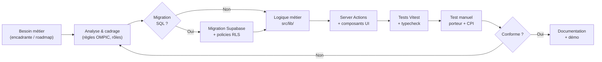
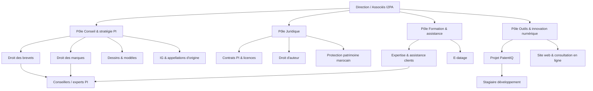

# Rapport de stage

---

**[Prénom NOM]**  
Étudiant(e) en [nom de la filière] — [Nom de l'école]  
Promotion [année]

**Stage du [date début] au [date fin]**  
Durée : [X] semaines · Temps plein / [X] jours par semaine

**Entreprise / structure d'accueil :** I2PA — International Intellectual Property Assistance  
**Site web :** [https://i2pa.com/](https://i2pa.com/)  
**Siège :** Lot Massira, Rés. Costa del Sol, Mohammedia, Maroc  
**Encadrante / maître de stage :** [à compléter]  
**Tuteur pédagogique :** [à compléter]

> **Guide de finalisation (à faire avant export Word/PDF)**  
> 1. Remplacer tous les champs `[Prénom NOM]`, dates, école, filière, encadrante.  
> 2. Ajuster le **journal de bord** (Annexe D) à votre calendrier réel.  
> 3. Insérer les **captures d'écran** listées en Annexe B (16–18 images).  
> 4. Exporter les diagrammes UML/Gantt depuis [mermaid.live](https://mermaid.live).  
> 5. Relire Chapitres 6–7 : chiffres à jour (**32 migrations**, **84 tests Vitest**, **3 E2E**).  
> 6. Supprimer ce encadré avant remise officielle.

---

# Remerciements

Avant d'entrer dans le vif du sujet, je tiens à remercier l'équipe d'**[I2PA — International Intellectual Property Assistance](https://i2pa.com/)** de m'avoir accueilli au sein de cette structure spécialisée en propriété intellectuelle, reconnue pour son accompagnement des porteurs de projets au Maroc et à l'international.

Je remercie tout particulièrement **[prénom nom de l'encadrante]**, qui m'a accompagné pendant ces **[X] semaines**. Quand j'ai commencé, j'avoue que je confondais brevet, marque et dessin industriel, et que l'acronyme OMPIC ne me disait rien de concret. Elle a pris le temps de m'expliquer comment un porteur de projet prépare réellement un dossier au Maroc, comment un CPI lit les pièces, pourquoi la surveillance d'une marque déposée n'a rien à voir avec l'attente de publication d'un brevet.

La **réunion de suivi** a particulièrement marqué mon travail. Je me souviens de sa formulation : *« Les systèmes sont différents par rapport aux produits. »* Ce n'était pas une remarque anecdotique — ça a orienté des semaines de développement. D'un côté, la marque avec sa publication, ses deux mois d'opposition, le catalogue OMPIC ; de l'autre, le brevet avec ses dix-huit mois avant publication, les revendications confidentielles, la veille technologique. Sans ces échanges, j'aurais probablement codé une seule checklist générique et une seule timeline pour tout le monde. Ce n'est pas ce qu'on attendait.

Je remercie aussi **[tuteur académique]** pour le suivi pédagogique côté école : relecture du plan, rappel de structurer le rapport, et incitation à produire des diagrammes UML exploitables dans Word.

Enfin, merci aux personnes — et parfois à moi-même avec deux navigateurs en parallèle — qui ont testé PatentIQ en **double session** : un compte porteur, un compte CPI. C'est banal à dire, mais beaucoup de bugs n'apparaissent que quand on change de rôle. Si je n'avais testé qu'en porteur, j'aurais pu livrer une application « qui marche pour moi » sans être utilisable en conditions réelles.

---

# Résumé

La propriété intellectuelle concerne des démarches longues, coûteuses et sensibles. Un inventeur ou une startup doit décrire son innovation, rassembler des preuves, vérifier qu'elle n'existe pas déjà ailleurs (antériorité), collaborer avec un conseil en propriété industrielle (CPI), parfois solliciter un expert technique, puis — une fois le titre obtenu — décider comment l'exploiter commercialement. Dans la pratique, ces étapes sont souvent éparpillées entre emails, fichiers cloud mal nommés et recherches sur Espacenet sans lien avec le dossier client.

Pendant mon stage au sein d'**I2PA** (International Intellectual Property Assistance, [i2pa.com](https://i2pa.com/)), j'ai participé au développement de **PatentIQ**, une plateforme web full-stack qui centralise ce parcours. L'application s'adresse au contexte **marocain et OMPIC** : elle ne remplace pas le portail officiel de dépôt (**directompic.ma**), mais structure la préparation du dossier, la collaboration multi-acteurs, les recherches d'antériorité assistées par IA, la surveillance post-dépôt et la veille technologique.

Mon travail s'est articulé en **deux grandes phases**, complétées par une **phase de finition**. La **Phase 1** (déjà amorcée à mon arrivée) posait le socle : authentification multi-rôles, gestion de projets, documents versionnés, checklist par type de dossier, messagerie, tâches, notifications, espace CPI avec Kanban, analyses IA asynchrones (API EPO OPS + synthèse Hugging Face), assistant conversationnel et interface responsive. La **Phase 2**, alignée sur les attentes de mon encadrante, a ajouté : surveillance OMPIC live (watchlist, alertes de similarité, recherche marque), veille technologique par mots-clés, rédaction structurée de brevet et éditeur de revendications, cycles de vie distincts marque (opposition ~2 mois) et brevet (publication ~18 mois), rappels d'échéances PI, renforcement sécurité (email confirmé, 2FA TOTP), et refonte de l'interface en style application professionnelle. La **Phase 3** a consolidé la crédibilité métier (checklist auto, fiche opposition, historique rédaction), l'UX SaaS (onboarding, empty states, mobile), la robustesse technique (health check, cache OMPIC, tests E2E Playwright) et l'extension **dessins & modèles** en surveillance et veille.

Sur le plan technique, PatentIQ repose sur **Next.js 14** (App Router), **TypeScript**, **Supabase** (PostgreSQL avec RLS, Auth, Storage), **Tailwind CSS** et **shadcn/ui**. À la fin du stage, le dépôt compte **32 migrations SQL**, **84 tests unitaires** Vitest, **3 tests E2E** Playwright, une documentation de démo pour l'encadrante (`DEMO_ENCADRANTE.md`), des diagrammes UML enrichis incluant un **diagramme de Gantt**, et un guide de déploiement sur Vercel.

**Mots-clés :** propriété intellectuelle, OMPIC, brevet, marque, dessin et modèle, Next.js, Supabase, workflow, intelligence artificielle, antériorité, surveillance, veille technologique.

---

# Introduction

## Pourquoi ce stage m'intéressait

Je suis étudiant(e) en **[filière]** à **[école]**. Avant ce stage, mon expérience web se limitait surtout à des applications « classiques » : formulaires, listes, authentification basique. Quand on m'a proposé PatentIQ, j'ai d'abord imaginé un site administratif avec des PDF à uploader. En réalité, j'ai découvert un domaine où **le métier impose des contraintes fortes au code** : qui a le droit de lire une revendication, à quel moment une marque entre en surveillance, pourquoi une notification doit arriver chez le CPI assigné et pas chez un autre utilisateur.

Ce qui m'a motivé, c'est la combinaison suivante :

- plusieurs **rôles** avec des espaces différents (porteur, CPI, expert, admin) ;
- des **règles de workflow** non triviales (on ne passe pas n'importe quel statut à n'importe quel statut) ;
- des **APIs externes** (EPO, Hugging Face, futur proxy OMPIC) ;
- un **traitement asynchrone** (worker IA, cron surveillance) ;
- des **retours métier concrets** via mon encadrante.

Bref, un projet proche de ce qu'on peut rencontrer en entreprise, pas un exercice scolaire isolé.

## Objectifs qui m'ont été fixés

PatentIQ vise à **préparer et suivre** un dossier de propriété intellectuelle. Il ne s'agit pas de déposer officiellement une marque ou un brevet depuis l'application : le dépôt reste sur les portails OMPIC / directompic. L'objectif est de donner au porteur et au CPI un **espace de travail partagé**, traçable et sécurisé.

Mes missions principales :

1. **Comprendre** le parcours porteur / CPI / expert, en particulier au Maroc ;
2. **Consolider** la Phase 1 (collaboration, IA, espace CPI) ;
3. **Implémenter** la Phase 2 selon la roadmap encadrante (surveillance, rédaction, cycles PI, sécurité) ;
4. **Améliorer** l'expérience utilisateur pour une présentation professionnelle ;
5. **Consolider** la robustesse (tests, perf, health check) et étendre aux **dessins & modèles** ;
6. **Documenter** le projet (UML, Gantt, guide de démo, rapport).

## Démarche méthodologique

La réalisation de PatentIQ au sein d'I2PA ne relève pas d'un développement « en une seule fois » (*big bang*), mais d'une **approche incrémentale et itérative**, guidée par les retours métier de mon encadrante. Le domaine — propriété intellectuelle marocaine, workflows OMPIC, confidentialité des dossiers — impose en effet de **valider tôt** chaque fonctionnalité avec un regard juridique, et non seulement technique.

### Approche retenue

J'ai combiné trois principes :

1. **Développement orienté métier** — chaque module répond à une étape concrète du parcours porteur / CPI (documents, antériorité, surveillance, rédaction) ;
2. **Livraisons courtes** — une migration SQL, une Server Action ou un composant UI à la fois, testé avant de passer au suivant ;
3. **Boucle de feedback** — réunions avec l'encadrante, tests manuels en double session (porteur + CPI), correction immédiate des écarts.

Cette démarche s'inspire du **cycle itératif** des méthodes agiles (planifier → développer → tester → ajuster), sans formalisme Scrum complet : pas de daily stand-up ni de sprint reviews officielles, but une **roadmap priorisée** et des points réguliers avec l'encadrante.

### Découpage en deux phases

Le stage s'organise en **deux grandes phases**, visibles dans le diagramme de Gantt (`docs/DIAGRAMMES_UML.md`, section 6) :

| Phase | Période indicative | Objectif | Principaux livrables |
|-------|-------------------|----------|----------------------|
| **Phase 1 — Socle** | Sem. 1 à 10 | Poser les fondations collaboratives | Auth multi-rôles, projets, documents, checklist, messagerie, espace CPI, module IA (EPO + Hugging Face), chat |
| **Phase 2 — Attentes encadrante** | Sem. 11 à 21 | Aligner l'outil sur la pratique I2PA / OMPIC | Surveillance, veille techno, cycles marque/brevet, échéances PI, rédaction brevet, revendications, 2FA, refonte UI |
| **Phase 3 — Finitions** | Sem. 22 à 24 | Crédibilité métier, UX, robustesse | Checklist auto, opposition, dessins & modèles, perf navigation, health check, E2E |
| **Livrables finaux** | Sem. 24 | Capitaliser et présenter | 84 tests Vitest + 3 E2E, UML, guide démo, rapport, soutenance |

La **Phase 1** existait partiellement à mon arrivée : mon rôle a été de **consolider**, corriger et documenter. La **Phase 2** est née de la **réunion de suivi** avec l'encadrante et de la roadmap `ROADMAP_ATTENTES_ENCADRANTE.md`.

### Collecte et analyse des besoins

Les besoins ont été recueillis par **plusieurs canaux complémentaires** :

| Source | Méthode | Apport |
|--------|---------|--------|
| **Encadrante I2PA** | Réunions de suivi, retours sur maquettes et démos | Priorisation surveillance, distinction marque/brevet, exigences confidentialité |
| **Documentation OMPIC / directompic** | Lecture des délais officiels (opposition ~2 mois, publication ~18 mois) | Cycles de vie et rappels d'échéances |
| **Analyse de l'existant** | Observation des pratiques cabinet (email, Drive, Espacenet) | Identification des ruptures à combler (cf. chapitre 1, § 1.4–1.5) |
| **État de l'art technique** | Comparaison Espacenet, logiciels PI, stack Next.js/Supabase | Choix technologiques (cf. chapitre 3) |
| **Tests utilisateurs simulés** | Double session navigateur (porteur + CPI) | Détection des bugs de permissions, URLs, notifications |

Les besoins ont été **formalisés** dans la roadmap interne, puis **traduits** en migrations SQL, règles métier (`src/lib/`) et interfaces React. Chaque attente encadrante est **traçable** dans l'annexe F (mapping attentes ↔ fonctionnalités).

### Cycle de développement d'une fonctionnalité

Chaque lot Phase 2 a suivi le **même enchaînement**, représenté ci-dessous :



*Figure 0 — Cycle de développement d'une fonctionnalité PatentIQ.*

**Exemple concret — surveillance OMPIC :** besoin encadrante → migration `00025_surveillance_claims.sql` → provider stub/proxy → watchlist + alertes → tests RLS → validation bi-rôles → entrée dans `DEMO_ENCADRANTE.md`.

### Outils et environnement

| Catégorie | Outils utilisés | Rôle |
|-----------|-----------------|------|
| **Code source** | Git, VS Code / Cursor | Versionnement, développement |
| **Frontend** | Next.js 14 (App Router), TypeScript, Tailwind, shadcn/ui | Interface web responsive |
| **Backend / BDD** | Supabase (PostgreSQL, Auth, Storage, RLS) | Données, sécurité, fichiers |
| **IA & APIs** | EPO OPS, Hugging Face, worker asynchrone | Antériorité, synthèse, chat |
| **Qualité** | Vitest, ESLint, `tsc --noEmit` | Tests unitaires, lint, typage |
| **Documentation** | Markdown, Mermaid | UML, Gantt, guide démo, rapport |
| **Déploiement** | Vercel (cible), variables `.env.local` | Hébergement et configuration |

L'environnement local repose sur `npm run dev` pour l'application et, pour les analyses IA, un **worker en boucle** (`npm run ai:worker:loop`) déclenché manuellement ou par cron.

### Stratégie de validation

La validation repose sur **trois niveaux** :

1. **Automatisée** — suite Vitest (84 tests à la fin du stage) + 3 tests E2E Playwright : lifecycles marque/brevet, permissions, parsing checklist, surveillance OMPIC, dessins & modèles ;
2. **Typage et lint** — `npm run typecheck` et `npm run lint` avant chaque livraison significative ;
3. **Manuelle bi-rôles** — grille de validation (chapitre 7) : connexion porteur et CPI sur le même dossier, vérification des notifications, des transitions de statut et de l'isolation RLS.

Point méthodologique important : après **chaque migration** touchant aux permissions, je testais systématiquement avec **deux comptes distincts** — un porteur qui ne doit pas accéder au dossier d'un autre, et le CPI assigné qui doit le voir. Cette habitude a évité plusieurs failles de sécurité.

### Pilotage du temps et livrables

Le **pilotage** s'est appuyé sur :

- un **journal de bord hebdomadaire** (annexe D) : activités, difficultés, résultats ;
- le **diagramme de Gantt** (annexe E / `DIAGRAMMES_UML.md`) pour visualiser Phase 1, Phase 2 et livrables ;
- des **points encadrante** aux moments clés (cadrage Phase 2, validation démo, préparation soutenance).

**Livrables attendus en fin de stage :**

- application PatentIQ fonctionnelle et déployable ;
- 32 migrations SQL versionnées ;
- documentation technique (`DIAGRAMMES_UML.md`, `DEMO_ENCADRANTE.md`, `README.md`) ;
- rapport de stage et supports de soutenance.

Cette démarche m'a permis de concilier **rigueur académique** (traçabilité, diagrammes, tests) et **réalisme professionnel** (itérations courtes, retours métier, dette technique assumée et documentée au chapitre 8).

## Organisation de ce rapport

Le **chapitre 1** présente l'organisme d'accueil I2PA. Le **chapitre 2** pose le contexte PI et le positionnement de PatentIQ. Le **chapitre 3** compare l'existant technique. Le **chapitre 4** détaille les utilisateurs. Le **chapitre 5** décrit la conception (architecture, données, UI, UML/Gantt). Le **chapitre 6** est le cœur technique : ce que j'ai développé. Le **chapitre 7** traite des tests. Le **chapitre 8** raconte les difficultés. Le **chapitre 9** est mon bilan personnel. L'**introduction** expose aussi la **démarche méthodologique** (approche incrémentale, phases, cycle de développement, validation). Les **annexes** complètent avec glossaire, captures, commandes et journal de bord.

Les diagrammes UML et le Gantt sont dans **`docs/DIAGRAMMES_UML.md`**.

---

# Chapitre 1 — Présentation de l'organisme d'accueil

Mon stage s'est déroulé au sein d'**I2PA** (*International Intellectual Property Assistance*), cabinet marocain spécialisé en propriété intellectuelle. Ce chapitre présente l'entreprise telle qu'elle se décrit sur son site officiel [i2pa.com](https://i2pa.com/), son organisation telle que je l'ai comprise sur place, le service dans lequel j'ai été intégré, et l'analyse de l'existant qui a motivé le projet **PatentIQ**.

---

## 1.1 Présentation de l'entreprise

### Identité et positionnement

**I2PA** — *International Intellectual Property Assistance* — est une structure d'assistance et de conseil en **propriété intellectuelle**, basée au **Maroc**. Son slogan public est : *« Protéger, valoriser, innover »*. Sur son site, I2PA se présente comme un **expert en propriété intellectuelle**, avec une approche orientée vers la protection durable des actifs immatériels et la valorisation stratégique des innovations.

L'entreprise s'adresse aux **entreprises, startups, inventeurs et créateurs**, au niveau **national et international**. Elle met en avant une démarche **sur mesure**, **proactive** et **rigoureuse**, adaptée aux spécificités de chaque dossier (brevet, marque, dessin et modèle, droit d'auteur, contrats PI, etc.).

**Coordonnées publiques** (source : [i2pa.com](https://i2pa.com/)) :

| Information | Détail |
|-------------|--------|
| Adresse | Lot Massira, Résidence Costa del Sol, **Mohammedia**, Maroc |
| Téléphone | (+212) 615 539 752 |
| E-mail | Contact@i2pa.com |
| Horaires | Lundi – Vendredi, 09h00 – 18h00 |

### Historique

Le site [i2pa.com](https://i2pa.com/) ne publie pas, à ce jour, une chronologie détaillée de la création juridique ou des dates de fondation de la structure. En revanche, la communication de l'entreprise insiste sur une **expertise construite autour du droit marocain de la PI** et sur une **intervention nationale et internationale**, avec un réseau de partenaires juridiques à l'étranger.

D'un point de vue métier, I2PA se positionne comme un **partenaire stratégique** des acteurs innovants : PME, startups technologiques, grands comptes, inventeurs individuels. Les témoignages publiés sur le site (accompagnement brevets, dépôt de marques au Maroc, rédaction de contrats de licence) illustrent une activité récente et orientée **conseil + exécution** des démarches PI, plutôt qu'un simple courtage administratif.

Pour mon rapport, j'ai retenu l'idée suivante : I2PA n'est pas un office de dépôt (ce rôle relève de l'**OMPIC** et des portails officiels comme **directompic.ma**), mais un **cabinet d'assistance** qui accompagne le client avant, pendant et après les démarches officielles — exactement le créneau où PatentIQ intervient comme outil interne et démonstrateur.

### Missions

D'après la page [À propos](https://i2pa.com/a-propos), la mission d'I2PA peut se résumer en trois axes :

1. **Protéger** les actifs immatériels (brevets, marques, dessins et modèles, droits d'auteur, contrats) ;
2. **Valoriser** le capital intellectuel des clients (stratégie, licensing, croissance) ;
3. **Défendre** les intérêts des porteurs de droits (veille, surveillance, contentieux dans une logique de conseil).

La **vision** affichée est claire : *« Sécuriser l'innovation, stimuler la croissance »*. I2PA considère qu'une protection juridique efficace est un **pilier de compétitivité**, notamment dans un environnement où l'innovation est un moteur économique.

L'entreprise met également l'accent sur :

- l'**expertise juridique pointue** (marques, brevets, contrats) ;
- le **conseil personnalisé** à chaque étape ;
- la **veille concurrentielle** et la gestion stratégique des droits ;
- un **accompagnement adapté** à la taille de structure (startup, PME, grand groupe).

C'est dans cette logique que s'inscrit PatentIQ : outil numérique au service d'une mission déjà existante chez I2PA, à savoir structurer, sécuriser et valoriser les dossiers PI.

### Activités

I2PA propose une **gamme de services spécialisés**, regroupés sur le site en neuf domaines d'intervention :

| Service | Contenu (tel que présenté sur i2pa.com) |
|---------|----------------------------------------|
| **Formation, expertise et assistance** | Accompagnement et montée en compétence des clients sur les enjeux PI |
| **Droit des brevets** | Dépôt, rédaction, stratégie et gestion des inventions |
| **Droit des dessins et modèles** | Protection de l'apparence des produits |
| **Droit des marques** | Dépôt, surveillance et défense des signes distinctifs |
| **Indications géographiques et appellations d'origine** | Protection des produits territoriaux |
| **E-datage** | Preuve de date et sécurisation de créations |
| **Droit d'auteur** | Protection des œuvres et contenus |
| **Contrats liés à la propriété intellectuelle** | Licences, cession, accords de partenariat |
| **Protection du patrimoine marocain** | Valorisation et défense du patrimoine intellectuel national |

En pratique, ces activités impliquent des tâches que j'ai retrouvées dans le cahier des charges de PatentIQ : collecte documentaire, recherche d'antériorité, rédaction de revendications, suivi des échéances (publication, opposition), surveillance post-enregistrement, et veille technologique continue.

I2PA propose aussi une **consultation en ligne** via son site (« Plan I2PA Personnalisé », évaluation par service), ce qui montre une volonté de **digitaliser le premier contact** client — PatentIQ prolonge cette orientation en digitalisant le **suivi du dossier** une fois la relation établie.

---

## 1.2 Organisation de l'entreprise

### Organigramme (schéma fonctionnel)

Le site public ne publie pas d'organigramme officiel détaillé. Sur la base de l'organisation type d'un cabinet PI et des services listés par I2PA, j'ai représenté ci-dessous une **structure fonctionnelle plausible**, à valider ou corriger avec mon encadrante lors de la soutenance.



*Figure 1 — Organigramme fonctionnel I2PA (schéma indicatif pour le rapport de stage).*

### Départements et services

On peut regrouper l'activité d'I2PA en **quatre pôles** :

**1. Pôle conseil et stratégie PI**  
Cœur métier : analyse des besoins client, stratégie de dépôt (Maroc / international), pilotage des dossiers brevets et marques, coordination avec l'OMPIC et les offices étrangers.

**2. Pôle juridique**  
Rédaction et relecture des actes sensibles (revendications, descriptions, contrats de licence et de cession), conformité aux exigences OMPIC, gestion des aspects contentieux et contractuels.

**3. Pôle formation et assistance**  
Sessions de formation, assistance aux porteurs peu familiarisés avec la PI, services complémentaires (e-datage, documentation).

**4. Pôle outils et innovation numérique**  
Présence web ([i2pa.com](https://i2pa.com/)), formulaire de consultation, et — dans le cadre de mon stage — développement de **PatentIQ** comme plateforme interne / démonstrateur pour structurer les dossiers et la collaboration CPI–porteur.

Les **conseillers en propriété industrielle** (CPI) et experts associés interviennent transversalement sur les dossiers clients, quel que soit le pôle d'origine du service commandé.

---

## 1.3 Présentation du service d'accueil

J'ai effectué mon stage au sein du volet **outils numériques / innovation**, rattaché métier au pôle conseil PI. Concrètement, mon encadrante — profil **conseil en propriété industrielle** — m'a transmis les retours terrain issus de la pratique quotidienne chez I2PA : comment un dossier marque diffère d'un dossier brevet, quelles étapes manquent dans les outils génériques, quels risques de confidentialité existent avant dépôt.

**Rôle du service d'accueil dans mon stage :**

| Aspect | Description |
|--------|-------------|
| **Objectif** | Concevoir et développer PatentIQ, plateforme d'assistance au parcours PI |
| **Lien métier** | Alignement sur les services I2PA (brevets, marques, contrats, valorisation) |
| **Lien OMPIC** | Prise en compte des délais marocains (opposition marque, publication brevet) |
| **Livrables** | Application web, documentation, scénario de démo, diagrammes UML |
| **Encadrement** | Réunions de suivi, validation des priorités (surveillance, rédaction, etc.) |

Mon travail ne consistait pas à remplacer les conseillers I2PA, mais à leur fournir — et à terme à leurs clients — un **espace de travail partagé** : documents centralisés, checklist par type de dossier, messagerie, analyses d'antériorité assistées par IA, surveillance OMPIC et veille technologique.

Le choix de nom **PatentIQ** (« IQ » pour intelligence / qualité du dossier) reflète cette double ambition : rigueur intellectuelle du conseil PI et apport de l'**intelligence artificielle** pour la recherche et la rédaction assistée — toujours sous responsabilité du CPI, comme I2PA le rappelle dans sa communication professionnelle.

---

## 1.4 Analyse de l'existant

Avant PatentIQ — et en dehors de tout outil métier intégré — le fonctionnement typique d'un cabinet comme I2PA, tel que je l'ai compris à travers les échanges de stage, repose sur un **existing mixte** :

### Côté métier (pratiques I2PA)

- **Relation client** : rendez-vous, consultations (y compris via le site I2PA), emails, échanges téléphoniques ;
- **Production juridique** : rédaction de descriptions, revendications, stratégies de dépôt — souvent sous Word/PDF ;
- **Recherches** : antériorité brevet via bases publiques (Espacenet, EPO OPS, Google Patents), recherches marque via portails OMPIC ;
- **Suivi post-dépôt** : surveillance manuelle ou via outils tiers pour les marques ; rappels d'échéances souvent gérés par agenda ou tableur ;
- **Valorisation** : discussions contractuelles (licences, partenariats) peu structurées dans un outil unique.

### Côté outils informatiques (avant / en parallèle de PatentIQ)

| Outil | Usage | Limite observée |
|-------|-------|-----------------|
| Messagerie email | Échanges porteur ↔ CPI | Fil non structuré par dossier |
| Drive / fichiers locaux | Stockage PDF | Versions floues, droits mal maîtrisés |
| Espacenet / Google Patents | Antériorité | Résultats non liés au dossier client |
| Portails OMPIC | Dépôt et consultation | Hors collaboration cabinet–client |
| Tableurs / agenda | Échéances | Pas de lien automatique avec le statut dossier |
| Site i2pa.com | Vitrine + prise de contact | Pas de suivi dossier opérationnel |

PatentIQ est né de ce constat : I2PA dispose d'une **expertise métier reconnue** et d'une **offre de services large**, but le **suivi opérationnel du dossier** restait fragmenté entre canaux généralistes.

---

## 1.5 Critique de l'existant

L'analyse critique — validée par les retours de mon encadrante lors de la réunion de suivi — met en évidence plusieurs **faiblesses** :

**1. Fragmentation de l'information**  
Un même dossier peut exister simultanément dans des mails, des dossiers cloud mal nommés et des notes personnelles du conseiller. Retrouver « la dernière version » d'une revendication ou d'un rapport d'antériorité devient chronophage.

**2. Absence de traçabilité**  
Il est difficile de prouver *a posteriori* qu'une étape clé a été faite (recherche documentée, validation CPI, demande de pièces). Or, en PI, la **preuve de diligence** compte autant que le fond.

**3. Non-différenciation marque / brevet**  
Les outils génériques traitent tous les dossiers de la même façon. Or I2PA commercialise des services distincts (droit des marques vs droit des brevets) parce que les **procédures OMPIC** diffèrent (opposition ~2 mois vs publication ~18 mois, surveillance catalogue marques vs veille brevet).

**4. Surveillance et veille peu industrialisées**  
L'encadrante a insisté sur la **surveillance des marques** et la **veille technologique** continue. Sans plateforme dédiée, ces tâches reposent sur la vigilance individuelle du conseiller — difficilement scalable quand le portefeuille clients grandit.

**5. Risques de confidentialité**  
Avant dépôt, les informations d'invention sont sensibles. Les outils grand public (mail non chiffré, partage cloud mal configuré) exposent à des fuites involontaires. I2PA promeut une image de rigueur ; l'outil interne doit être **au niveau** de cette promesse (authentification, espaces isolés, RLS, 2FA).

**6. Valorisation post-titre non structurée**  
Une fois le brevet ou la marque obtenu, le suivi ne s'arrête pas : la **surveillance** des titres similaires et la **veille technologique** restent nécessaires pendant des années. Sans outil dédié, ces activités restent difficiles à tracer dans le dossier client.

**7. Écart vitrine web / réalité opérationnelle**  
Le site [i2pa.com](https://i2pa.com/) présente une image professionnelle et un parcours de **consultation en ligne**, but il ne remplace pas un **workspace dossier**. PatentIQ comble précisément cet écart côté exploitation interne et démo client.

---

## 1.6 Conclusion du chapitre

**I2PA** est un cabinet marocain d'assistance en propriété intellectuelle, orienté protection, valorisation et défense des actifs immatériels, avec une offre couvrant brevets, marques, dessins et modèles, droits d'auteur, contrats et services complémentaires (formation, e-datage, patrimoine marocain). Son ancrage **Mohammedia**, sa communication bilingue (français / anglais / arabe sur le site) et sa proximité avec l'écosystème **OMPIC** en font un cadre pertinent pour développer un outil PI « made in Morocco ».

L'**existant** — expertise humaine forte, outils informatiques généralistes — fonctionne pour des dossiers isolés, but montre ses limites dès que l'on veut **industrialiser** la collaboration, la surveillance et la traçabilité.

La **critique** de cet existant justifie le projet **PatentIQ** : plateforme web multi-rôles (porteur, CPI, expert, admin), alignée sur les services I2PA, respectant la spécificité marque/brevet/dessin, et renforçant sécurité et traçabilité du parcours PI.

Mon stage s'inscrit donc non pas dans une logique de « startup déconnectée du terrain », but comme **prolongement numérique** de la mission d'I2PA : *protéger, valoriser, innover* — avec un outil conçu pour le conseiller autant que pour le porteur de projet.

---

# Chapitre 2 — Comprendre le contexte de la propriété intellectuelle

## 2.1 Qu'est-ce que la PI, concrètement ?

La **propriété intellectuelle (PI)** regroupe les mécanismes juridiques qui protègent les créations de l'esprit. Sans prétendre à l'exhaustivité — je reste développeur, pas juriste — voici ce que j'ai retenu :

| Type | Objet protégé | Exemple |
|------|---------------|---------|
| **Brevet** | Invention technique nouvelle | Un filtre d'eau portable innovant |
| **Marque** | Signe distinctif (nom, logo) | Le nom d'une boisson énergisante |
| **Dessin / modèle** | Apparence d'un produit | La forme d'un emballage |
| **Secret d'affaires** | Information confidentielle | Une formule ou un procédé non divulgué |

Pour un **brevet**, l'invention doit notamment être **nouvelle**. D'où la **recherche d'antériorité** : parcourir brevets et publications existants pour estimer si l'invention a des chances d'être acceptée. Pour une **marque**, la logique est différente : après dépôt et **publication**, des tiers peuvent former **opposition** pendant une fenêtre limitée — au Maroc, mon encadrante m'a parlé d'environ **deux mois** après publication.

## 2.2 Ce que m'a appris la réunion encadrante

Plusieurs idées reviennent dans ses retours et dans le document `ROADMAP_ATTENTES_ENCADRANTE.md` :

**Marque — délais et surveillance.** Une marque déposée est publiée ; si personne ne s'y oppose, elle peut être enregistrée. Ensuite, le CPI et le client veulent **surveiller** le catalogue OMPIC pour détecter des marques similaires et, le cas échéant, agir (opposition, mise en demeure…). L'encadrante a mentionné que l'OMPIC publie un catalogue et que des plateformes pro existent pour détecter des similarités parfois avant même la publication officielle.

**Brevet — publication différée.** Un brevet national déposé au Maroc n'est pas publié immédiatement. Elle m'a indiqué un délai de l'ordre de **dix-huit mois** avant publication. Pendant cette période, la description reste confidentielle côté office, ce qui renforce l'enjeu de **sécurité** de notre plateforme en amont du dépôt.

**Veille technologique vs antériorité ponctuelle.** Une recherche d'antériorité au moment du dépôt ne suffit pas toujours : il faut parfois **continuer à surveiller** l'état de l'art (veille techno). Ce n'est pas la même chose qu'une recherche unique : c'est un suivi dans le temps.

**Revendications et confidentialité.** Les revendications définissent ce qui est protégé. C'est une partie **très sensible** du dossier brevet. L'encadrante a insisté sur la différence entre les échanges généraux (messages, commentaires) et le contenu qui doit rester **strictement confidentiel** jusqu'au dépôt.

**Sécurité de la plateforme.** Question directe lors du suivi : est-ce que les informations d'invention sont protégées avant le dépôt ? Email validé, espaces isolés, possibilité de renforcer l'authentification (2FA) — autant de points que nous avons pris au sérieux.

## 2.3 Le problème métier adressé par PatentIQ

En dehors d'outils spécialisés coûteux, beaucoup d'acteurs font encore :

- documents éparpillés (mail, WhatsApp, Drive) ;
- recherches brevet sur Espacenet **sans lien** avec le dossier client ;
- échanges CPI / porteur difficiles à retrouver ;
- aucun rappel structuré des échéances (fin d'opposition marque, publication brevet…) ;
- pas de vue portefeuille unifiée pour la surveillance post-enregistrement.

**Problématique :** comment centraliser la préparation et le suivi d'un dossier PI, faciliter la collaboration multi-acteurs, documenter l'antériorité, surveiller après dépôt, et garder une trace exploitable — dans un outil accessible et sécurisé ?

## 2.4 Positionnement de PatentIQ (OMPIC / Maroc)

PatentIQ se situe **en amont et en aval** du guichet officiel :

```
Porteur prépare ──► CPI valide ──► Dépôt OMPIC (hors plateforme)
     PatentIQ              PatentIQ         directompic.ma
                              │
                              └──► Surveillance, veille, opposition
                                   (toujours dans PatentIQ)
```

Point important : l'**OMPIC ne publie pas d'API REST publique** simple. Nous avons conçu un **provider configurable** (`OMPIC_SEARCH_MODE=stub|proxy|hybrid`) documenté dans `OMPIC_SURVEILLANCE.md`. En démo, le mode **stub** simule des similarités ; en production future, un **proxy** pourrait encapsuler un scraper ou un partenariat officiel.

---

# Chapitre 3 — État de l'art et solutions existantes

## 3.1 Outils publics de recherche

| Outil | Forces | Limites pour notre cas |
|-------|--------|------------------------|
| **Espacenet / EPO OPS** | Base brevets, API gratuite | Pas de dossier client ni CPI |
| **Google Patents** | Interface simple | Idem |
| **Portails OMPIC** | Données marocaines officielles | Pas de workflow collaboratif |

PatentIQ **s'appuie** sur EPO OPS pour la recherche brevet, mais **ancre** les résultats dans un projet précis, avec historique, notifications et lien checklist.

## 3.2 Logiciels professionnels de gestion PI

Des solutions comme Anaqua ou CPA Global ciblent les grands cabinets. Elles sont puissantes mais :

- coûteuses ;
- peu adaptées à un porteur solo ou une PME ;
- surdimensionnées pour une démo académique ou une startup early-stage.

PatentIQ vise un **positionnement intermédiaire** : outil web léger, hébergeable gratuitement en démo (Vercel + Supabase free tier), orienté parcours **porteur + CPI**.

## 3.3 Choix technologiques retenus

| Besoin | Technologie | Pourquoi ce choix |
|--------|-------------|-------------------|
| Frontend + API | Next.js 14 App Router | Full-stack TypeScript, SSR, Server Actions |
| Base + Auth + Fichiers | Supabase | PostgreSQL, RLS natif, Storage, tier gratuit |
| UI | Tailwind + shadcn/ui | Composants accessibles, cohérence visuelle |
| Validation | React Hook Form + Zod | Typage client/serveur |
| IA brevets | EPO OPS | Source officielle, quota gratuit |
| IA texte | Hugging Face | Modèles open source, tier gratuit |
| Tests | Vitest | Rapide, intégration facile |
| Cron surveillance | GitHub Actions | Scan hebdo sans serveur dédié |

Ce stack permet de livrer une démo crédible **sans budget cloud** au-delà du free tier.

---

# Chapitre 4 — Les utilisateurs, leurs besoins et un parcours concret

## 4.1 Les quatre rôles

### Porteur de projet (`project_holder`)

C'est l'inventeur, le chercheur ou l'entrepreneur. Il :

- crée un dossier (titre, résumé invention, besoin PI, catégorie brevet/marque…) ;
- dépose des documents (PDF, plans…) ;
- coche la checklist ;
- lance des analyses IA ;
- échange via messages et répond aux tâches ;
- consulte le **Parcours PI** (cycle, rédaction, revendications) ;
- gère sa watchlist surveillance.

Son espace : **`/dashboard`**.

### Conseiller CPI (`cpi_advisor`)

Le CPI pilote les dossiers qui lui sont assignés. Il :

- consulte la liste et le **Kanban** par statut ;
- change les statuts selon des règles métier ;
- laisse des **commentaires juridiques** ;
- assigne des **tâches** au porteur ;
- valide la checklist ;
- édite cycles marque/brevet, rédaction, revendications ;
- surveille les alertes et gère les **oppositions** marque si nécessaire.

Son espace : **`/cpi`**, dossier détaillé **`/cpi/cases/[id]`**.

### Expert (`expert`)

Intervient sur les dossiers en `expert_review`. Il :

- consulte les projets assignés ;
- dépose un **avis structuré** (faisabilité, recommandation, risques) ;
- participe à la messagerie.

Son espace : **`/expert`**.

### Administrateur (`admin`)

Gère la plateforme : utilisateurs, projets globaux, paramètres, **logs d'audit**.

Son espace : **`/admin`**.

## 4.2 Scénario narratif — projet brevet « gourde filtrante »

Pour m'y retrouver, j'ai souvent rejoué ce scénario :

1. **Marie** (porteur) crée le projet, catégorie **brevet**, décrit une gourde avec filtre UV portable.
2. Elle upload un PDF de description et une photo.
3. Elle lance une analyse IA **nouveauté** ; le worker interroge EPO OPS et produit une synthèse HF.
4. Elle coche une partie de la checklist et **soumet** le dossier.
5. **Jean** (CPI) reçoit une notification, ouvre `/cpi/cases/...`, demande une pièce complémentaire, crée une tâche.
6. Marie répond, remet un document. Jean passe le statut en `cpi_review`, puis `approved`.
7. Dans **Parcours PI**, ils complètent la rédaction brevet et les revendications.
8. Jean avance le **cycle brevet** (déposé → attente publication 18 mois…).
9. Marie ajoute la marque/brevet à la **watchlist** surveillance.
10. Une alerte de similarité apparaît ; Jean prépare une **fiche opposition** sur l'alerte.

## 4.3 Scénario narratif — projet marque

1. Porteur crée un projet **marque** (ex. nom de boisson).
2. CPI fait avancer le **cycle marque** : déposé → publié (2 mois) → enregistré → surveillance active.
3. À la publication, le système calcule une **échéance opposition** ; un rappel apparaît sur le tableau de bord si la date approche.
4. Surveillance : recherche de similarités (stub OMPIC en démo) → **alerte** → notification porteur + CPI.

## 4.4 Workflow des statuts projet

```
draft → submitted → in_review → awaiting_documents
  → expert_review → cpi_review → approved | rejected → closed
```

| Statut | Signification (tel que je l'ai compris) |
|--------|----------------------------------------|
| `draft` | Brouillon côté porteur |
| `submitted` | Dossier envoyé au CPI |
| `in_review` | Examen en cours |
| `awaiting_documents` | Pièces manquantes |
| `expert_review` | Avis expert demandé |
| `cpi_review` | Validation CPI finale |
| `approved` | Dossier validé par le CPI |
| `rejected` | Refus |
| `closed` | Archivé |

Les transitions ne sont pas libres : des fonctions comme `resolveStatusChangeMode()` et `isCpiStatusTransitionAllowed()` encadrent qui peut faire quoi.

---

# Chapitre 5 — Conception du système

## 5.1 Architecture globale

```
┌──────────────┐     ┌──────────────────────────┐     ┌─────────────────┐
│  Navigateur  │────►│  Next.js 14              │────►│  Supabase       │
│  React UI    │     │  Server Actions + API    │     │  PostgreSQL RLS │
└──────────────┘     └────────────┬─────────────┘     │  Auth · Storage │
                                  │                   └─────────────────┘
                                  ▼
                     ┌──────────────────────────┐
                     │  APIs externes           │
                     │  EPO OPS · Hugging Face  │
                     │  OMPIC stub/proxy        │
                     └──────────────────────────┘
                                  ▲
                     ┌────────────┴─────────────┐
                     │  Workers                 │
                     │  IA (loop local)         │
                     │  Surveillance (cron GH)  │
                     └──────────────────────────┘
```

Le **middleware** Next.js rafraîchit la session Supabase, vérifie l'email confirmé, redirige selon le rôle, et protège les routes admin/CPI/expert.

## 5.2 Modèle de données — vue d'ensemble

L'entité centrale est **`projects`**. Chaque projet possède un code auto `PRJ-XXXXXXXX`, un propriétaire, un CPI assigné optionnel, un expert optionnel, un statut workflow, et des métadonnées JSON (checklist, cycles marque/brevet…).

### Tables Phase 1 (socle)

| Table | Rôle |
|-------|------|
| `profiles` | Profils utilisateurs |
| `roles` / `user_roles` | Rôles applicatifs |
| `projects` | Dossiers PI |
| `documents` / `document_versions` | Fichiers et historique |
| `messages` | Fil de discussion projet |
| `project_tasks` | Tâches |
| `project_comments` | Commentaires (dont juridiques) |
| `project_updates` | Timeline activité |
| `ai_searches` / `ai_results` | Analyses IA |
| `ai_chat_sessions` / `ai_chat_messages` | Assistant chat |
| `notifications` | Alertes in-app |
| `audit_logs` | Traçabilité admin |

### Tables Phase 2 (extensions)

| Migration | Tables / types | Rôle |
|-----------|----------------|------|
| `00025` | `ip_watchlist`, `ip_watch_alerts`, `patent_claims_drafts` | Surveillance + revendications |
| `00026` | `ip_tech_watch` | Veille technologique |
| `00027` | `patent_drafts` | Rédaction brevet structurée |
| `00028` | colonnes portefeuille watchlist | Logo, date enregistrement OMPIC |
| `00029` | type `ai_search_type` + `fto` | Analyse liberté d'exploitation (FTO) |
| `00030` | `patent_draft_versions` | Historique rédaction + métadonnées opposition |
| `00031` | type `design`, enum `tech_watch_kind` | Dessins & modèles — surveillance + veille |
| `00032` | suppression `project_commercialization` | Retrait module valorisation (hors périmètre final) |

Les **cycles marque et brevet** sont stockés dans `projects.metadata` (JSON), parsés par `marque-lifecycle.ts` et `brevet-lifecycle.ts`.

### Sécurité RLS

Des fonctions SQL centralisent les permissions : `can_view_project()`, `can_edit_project()`, `is_project_cpi()`, `has_role()`. Chaque nouvelle table Phase 2 a ses policies SELECT/INSERT/UPDATE. J'ai appris à **toujours** tester avec deux comptes après une migration : un porteur qui ne doit pas voir le dossier d'un autre, un CPI assigné qui doit voir le sien.

## 5.3 Organisation des routes (après refonte UI)

| Espace | URL | Accès |
|--------|-----|-------|
| Connexion | `/auth/login` | Public |
| Porteur | `/dashboard`, `/dashboard/projects/[id]` | `project_holder` |
| Surveillance porteur | `/dashboard/surveillance` | Porteur |
| CPI | `/cpi`, `/cpi/cases/[id]` | `cpi_advisor` |
| Expert | `/expert` | `expert` |
| Admin | `/admin` | `admin` |
| Sécurité 2FA | `/dashboard/security` | Authentifié |

La landing page marketing a été **supprimée** : `/` redirige vers la connexion. L'interface vise un rendu **application métier** (bleu #0A66C2 conservé).

## 5.4 Structure de la fiche projet (UI)

### Porteur — trois onglets principaux

| Onglet | Sections |
|--------|----------|
| **Dossier** | Informations invention/besoin, Documents, Checklist, Parcours PI |
| **Échanges** | Commentaires, Messages, Tâches |
| **Analyses IA** | Nouvelle analyse, Historique |

Le **Parcours PI** regroupe : Cycle OMPIC, Rédaction (brevet), Revendications, Surveillance (watchlist).

### CPI — même logique, actions enrichies

En-tête avec **nom du porteur**, bandeau KPI, formulaire changement de statut, onglets identiques avec droits CPI (commentaires juridiques, assignation tâches, édition cycles…).

## 5.5 Diagrammes UML et Gantt

Document **`docs/DIAGRAMMES_UML.md`** — à exporter via [mermaid.live](https://mermaid.live) :

1. **Cas d'utilisation** — Phase 1 + 2 (32 UC environ) ;
2. **Classes** — entités étendues watchlist, brouillon brevet, veille, dessin & modèle… ;
3. **Séquence antériorité IA** — worker, EPO, HF ;
4. **Séquence surveillance OMPIC** — live/stub/proxy, alertes, opposition ;
5. **Gantt** — planning Phase 1 / Phase 2 / Phase 3 / livrables (dates à personnaliser) ;
6. **Diagramme d'activité** — parcours dossier complet.

---

# Chapitre 6 — Réalisation : ce que j'ai développé en détail

## 6.1 Phase 1 — Socle (consolidation et corrections)

### Authentification, rôles et middleware

- Inscription / connexion Supabase (email, OAuth possible) ;
- Choix du rôle primaire à l'onboarding ;
- Middleware : redirection `/dashboard`, `/cpi`, etc. selon `user_roles` ;
- **Email confirmé obligatoire** — redirection vers `/auth/check-email` si non confirmé ;
- Guards serveur `requireUser()`, vérification rôle sur routes sensibles.

### Gestion des projets

- Création avec titre, description, résumé invention, besoin PI, catégorie ;
- Code référence auto ;
- Assignation CPI (migration `00023`) ;
- Server Actions `createProject`, `updateProjectStatus` avec règles `holder` / `cpi` / `admin`.

### Documents et Storage

- Upload vers bucket `project-documents` ;
- Versions historisées ;
- URLs signées pour téléchargement ;
- **OCR local** Tesseract.js dans le navigateur pour PDF scannés (gratuit, limité en performance sur gros fichiers).

### Checklist et lien antériorité

- Templates par catégorie dans `src/lib/checklists/templates.ts` (brevet, marque, dessin, veille…) ;
- Item « Recherche d'antériorité documentée » relié aux analyses IA type **nouveauté** ;
- Badge « Documentée » quand une analyse est `completed` ;
- URLs role-aware : le CPI arrive sur `/cpi/cases/[id]?tab=search`, pas sur l'URL porteur.

### Collaboration

- Messagerie par projet avec curseur de lecture ;
- Tâches avec priorités et statuts ;
- Commentaires dont **`is_legal`** pour le CPI ;
- Notifications cloche + badge ;
- **Bug corrigé** : marquer messages lus ne mettait pas à jour les notifications — liaison côté serveur.

### Espace CPI

- **Kanban** par statut avec règles de transition ;
- Export rapports CSV/HTML ;
- Formulaire création tâche pour le porteur ;
- Panneau avis expert si recommandations présentes.

### Module IA (antériorité et plus)

**Flux nouveauté :**

1. Clic « Lancer l'analyse » → INSERT `ai_searches` (`pending`) ;
2. Worker `npm run ai:worker:loop` → `POST /api/ai/worker` ;
3. Passage `processing` ;
4. Lecture `invention_summary` + documents ;
5. Requête **EPO OPS** (CQL) ou mode stub ;
6. Synthèse **Hugging Face** (modèle `Qwen2.5-7B-Instruct` après instabilité d'un modèle précédent) ;
7. INSERT `ai_results`, statut `completed`, notifications porteur + CPI.

**Correction EPO 404 :** mauvaise syntaxe CQL — passage à `txt all` et requêtes de secours.

**Chat assistant :** contexte dossier (documents, checklist, tâches, analyses, avis expert) injecté dans le prompt.

### UX Phase 1

- Responsive (sidebar → menu mobile sous 1024px) ;
- PWA installable ;
- Recherche globale Ctrl+K ;
- Guide « Premiers pas » par rôle (`/dashboard/guide`, `/cpi/guide`…) ;
- Menu simplifié (moins d'items, sections groupées).

---

## 6.2 Phase 2 — Attentes encadrante (développement principal)

### 5.2.1 Surveillance OMPIC — watchlist et alertes

**Besoin encadrante :** après dépôt marque, surveiller les similarités dans le catalogue OMPIC, informer le client, préparer une éventuelle opposition.

**Implémentation :**

- Tables `ip_watchlist` et `ip_watch_alerts` (migration `00025`) ;
- UI `/dashboard/surveillance` et `/cpi/surveillance` ;
- Formulaire watchlist (titre, type marque/brevet, territoire MA…) ;
- Provider OMPIC dans `src/lib/surveillance/ompic-provider.ts` :
  - **`stub`** — catalogue démo (similarités type noms proches) ;
  - **`proxy`** — appel `OMPIC_PROXY_URL` si configuré ;
  - **`hybrid`** — proxy puis fallback stub ;
- Scan via worker `POST /api/surveillance/worker` ;
- Cron hebdomadaire GitHub Actions (`.github/workflows/surveillance-scan.yml`) ;
- **Notifications CPI** quand nouvelle alerte (`scan-watchlist-core.ts`) ;
- Statuts alerte : `new`, `acknowledged`, `opposition_filed`, `dismissed`.

**Ce que je dis en démo :** le mode **`live`** interroge OMPIC via un proxy documenté (`OMPIC_PROXY_URL`) avec cache et rate limiting ; le mode **`stub`** reste disponible pour les démos hors réseau.

### 5.2.2 Veille technologique

**Besoin :** surveillance continue de l'état de l'art, pas seulement une recherche ponctuelle.

**Implémentation :**

- Table `ip_tech_watch` (migration `00026`) ;
- Mots-clés, classes IPC optionnelles, territoire (`MA+EP` par défaut) ;
- Runner `tech-watch-runner.ts` — scan EPO si clés configurées ;
- Résumé dernier rapport stocké ;
- Même worker/cron que la surveillance.

### 5.2.3 Rédaction brevet et revendications

**Besoin :** espace confidentiel distinct des simples échanges, sections alignées OMPIC.

**Rédaction (`patent_drafts`, migration `00027`) :**

- Sections : titre, domaine technique, état de l'art, description, revendications proposées, abrégé… ;
- Panel `PatentDraftPanel` dans Parcours PI ;
- Générateur brouillon IA `patent-draft-generator.ts` — suggestion à partir du résumé invention (disclaimer : aide, pas substitut CPI).

**Revendications (`patent_claims_drafts`, migration `00025`) :**

- Revendication indépendante + dépendantes (JSON) ;
- Panel dédié `PatentClaimsPanel` ;
- Accès RLS strict — visible aux membres autorisés du projet.

### 5.2.4 Cycles marque et brevet

**Cycle marque** (`marque-lifecycle.ts`) :

```
depose → publie (2 mois) → opposition_ouverte → enregistre → surveillance_active
```

Panels `MarqueLifecyclePanel` — dates publication, échéance opposition calculée.

**Cycle brevet** (`brevet-lifecycle.ts`) :

```
depose → examen → en_attente_publication (18 mois) → publie → accorde → surveillance_active
```

Panels `BrevetLifecyclePanel` — lien conceptuel directompic, date dépôt, échéance publication.

**Échéances PI** (`ip-deadlines.ts`, `deadline-reminders.ts`) :

- Calcul rappels opposition marque et publication brevet ;
- Widget tableau de bord porteur/CPI si échéance ≤ 30 jours ;
- Notifications via worker surveillance hebdo.

### 5.2.5 Dessins & modèles — surveillance et veille

**Besoin encadrante :** ne pas limiter la surveillance aux marques et brevets ; les **dessins et modèles industriels** ont aussi un cycle de protection et des risques de contrefaçon.

**Implémentation (migration `00031`) :**

- Extension du type d'actif `ip_asset_type` avec la valeur **`design`** ;
- Recherche EPO designs (`epo-design-search.ts`) en complément du catalogue OMPIC ;
- Veille technologique différenciée via enum `tech_watch_kind` (`patent` | `design`) ;
- Panels UI `DesignSearchPanel`, formulaire watchlist étendu, checklist dossier dessin ;
- Tests dédiés `design-surveillance.test.ts`.

### 5.2.6 Sécurité renforcée

- Email confirmé bloquant l'accès aux zones protégées ;
- **2FA TOTP** activable page `/dashboard/security` ;
- RLS sur toutes les tables Phase 2 ;
- Audit logs côté admin.

Réponse à la question encadrante sur le « risque de piratage » : authentification renforcée + isolation RLS + pas de partage public des dossiers. Le chiffrement applicatif des champs sensibles reste une piste future.

### 5.2.7 Refonte interface professionnelle

Problème ressenti : trop d'éléments, menu chargé, landing marketing peu adaptée à une démo encadrante pro.

Actions réalisées :

- Suppression landing → redirection connexion ;
- **ProjectDetailHeader** — fil d'Ariane, référence, dernière activité ;
- **ProjectStatusBanner** — KPI (CPI/porteur, checklist %, tâches, IA, messages) ;
- Onglets **underline** style enterprise ;
- **ProjectSectionNav** — sous-sections Documents / Checklist / Parcours PI… ;
- Même refonte vue CPI `/cpi/cases/[id]` ;
- Couleur bleu **#0A66C2** conservée.

### 5.2.8 Documentation et démo

- `docs/DEMO_ENCADRANTE.md` — script 18 min, plan B, FAQ ;
- `docs/OMPIC_SURVEILLANCE.md` — contrat proxy, cron, modes live/stub ;
- `docs/DIAGRAMMES_UML.md` — UML + Gantt ;
- `docs/WORKER_AND_DEPLOY.md` — worker IA, déploiement Vercel.

---

## 6.3 Phase 3 — Finitions (crédibilité, UX, robustesse)

### Checklist automatique et crédibilité métier

- Synchronisation auto checklist ↔ analyses IA (`checklist-auto-sync.ts`) ;
- Analyse **FTO** (liberté d'exploitation) — migration `00029` ;
- **Historique rédaction** brevet (`patent_draft_versions`, migration `00030`) ;
- **Fiche opposition** sur alertes marque (métadonnées JSON sur `ip_watch_alerts`) ;
- Portefeuille watchlist enrichi (logo, date enregistrement — migration `00028`).

### Performance et expérience utilisateur

- Allègement du **middleware** (suppression de requêtes DB systématiques) ;
- `React.cache()` sur contexte utilisateur et compteur notifications ;
- Pages **`loading.tsx`** et **Suspense** sur dashboard, CPI, expert, admin ;
- Requêtes parallèles sur tableaux de bord ; notifications marquées lues côté client ;
- Onboarding, empty states, responsive mobile affiné.

### Robustesse technique

- Endpoint **`/api/health`** — vérification DB, Storage, variables critiques ;
- **Cache OMPIC** et rate limiting (`ompic-cache.ts`) ;
- Fallback synthèse LLM si quota dépassé ;
- **Tests E2E Playwright** (`e2e/smoke.spec.ts`) — 3 scénarios smoke (connexion, navigation) ;
- Retrait du module valorisation (migration `00032`) pour concentrer l'outil sur le parcours PI core.

---

## 6.4 Bugs et incidents marquants (et corrections)

| Problème | Impact | Correction |
|----------|--------|------------|
| CPI redirigé vers `/dashboard/projects/...` | Mauvaise UX notifications | `project-routes.ts`, URLs role-aware |
| EPO OPS 404 | Analyses vides | Syntaxe CQL corrigée |
| Analyses bloquées `pending` | Démo bloquée | Doc worker + `ai:worker:loop` |
| Compteur notifications | Badge faux positif | Lier lecture messages ↔ notifications |
| `useActionState` React 18 | Crash runtime | Remplacement par `useFormState` |
| Export types dans fichier `"use server"` | Erreur build | Split types dans fichiers dédiés |
| Navigation lente entre pages | UX dégradée | Middleware allégé, cache React, loading states |
| Menu trop long / utilisateur perdu | Abandon parcours | Simplification nav + guide intégré |

---

## 6.5 Arborescence code (simplifiée)

```
src/
├── app/
│   ├── (dashboard)/dashboard/     # Porteur
│   ├── cpi/                         # CPI
│   ├── expert/                      # Expert
│   ├── admin/                       # Admin
│   ├── auth/                        # Connexion
│   └── api/                         # Workers IA, surveillance
├── components/
│   ├── dashboard/                   # Onglets projet, checklist…
│   ├── cpi/                         # Kanban, case tabs
│   ├── surveillance/                # Parcours PI, panels
│   └── project/                     # Header, section nav, workspace
├── lib/
│   ├── actions/                     # Server Actions
│   ├── surveillance/                # OMPIC provider, scan, cache
│   ├── workflow/                    # Lifecycles, statuts, échéances
│   └── ai/                          # EPO, HF, worker
supabase/migrations/                 # 00001 → 00032
tests/                               # 84 tests Vitest (25 fichiers)
e2e/                                 # 3 tests Playwright smoke
docs/                                # Rapport, UML, démo, roadmap
```

---

# Chapitre 7 — Tests, validation et limites

## 7.1 Tests automatisés

**84 tests** répartis en **25 fichiers** Vitest, dont :

- `status-transitions.test.ts` — transitions CPI ;
- `epo-ops.test.ts` — requêtes EPO ;
- `checklist.test.ts`, `checklist-auto-sync.test.ts`, `prior-art.test.ts` — checklist et antériorité ;
- `marque-lifecycle.test.ts`, `brevet-lifecycle.test.ts` — cycles PI ;
- `ip-deadlines.test.ts` — échéances ;
- `patent-draft-generator.test.ts` — brouillon IA ;
- `surveillance-similarity.test.ts`, `design-surveillance.test.ts`, `ompic-cache.test.ts` — surveillance ;
- `dashboard-nav.test.ts` — navigation.

**Tests E2E Playwright** (`e2e/smoke.spec.ts`) — 3 scénarios : page login, accès dashboard authentifié, navigation projet.

Commandes :

```bash
npm test
npm run test:e2e
npm run typecheck
```

## 7.2 Tests manuels — grille de validation

| # | Scénario | Résultat attendu |
|---|----------|------------------|
| 1 | Porteur crée projet brevet + upload PDF | Document visible, checklist init |
| 2 | Analyse nouveauté + worker actif | `pending` → `completed`, résultats |
| 3 | Soumission dossier | CPI notifié, statut `submitted` |
| 4 | CPI change statut Kanban / formulaire | Porteur notifié |
| 5 | CPI commentaire juridique | Visible filtré juridique |
| 6 | CPI assigne tâche | Porteur voit tâche |
| 7 | Messages lus | Badge notifications baisse |
| 8 | Watchlist + scan (stub ou live) | Alerte similarité créée |
| 9 | Cycle marque → publié | Échéance opposition calculée |
| 10 | Actif type **design** en watchlist | Recherche EPO designs + OMPIC |
| 11 | Fiche opposition sur alerte | Métadonnées enregistrées |
| 12 | Activation 2FA | QR TOTP, vérification login |
| 13 | Mobile 375px | Onglets projet utilisables |
| 14 | CPI ouvre lien notification | Arrive sur `/cpi/cases/...` |
| 15 | `/api/health` | Statut OK (DB, Storage) |

Comptes test documentés : porteur `aminatkimbiri@gmail.com`, CPI `kimbiriaminata16@gmail.com`.

## 7.3 Limites assumées (transparence)

- **OMPIC** : mode `live` via proxy documenté ; fallback `stub` pour démo hors réseau ;
- **IA** : aide à la décision, pas avis juridique — le CPI reste responsable ;
- **OCR** : performance variable, gros PDF lents ;
- **Dépôt officiel** : hors scope — directompic.ma ;
- **Export zip dossier** (PDF rédaction + revendications + figures) : partiellement préparé, export complet prévu ;
- **Chiffrement champs sensibles** au niveau application : piste future ;
- **Valorisation commerciale** : module retiré du périmètre final (hors scope PatentIQ).

---

# Chapitre 8 — Difficultés rencontrées et solutions

## 8.1 Apprendre le métier PI en codant

**Difficulté :** vocabulaire dense, risque de coder une fausse généralisation (un seul workflow pour marque et brevet).

**Solution :** glossaire personnel, relecture `ROADMAP_ATTENTES_ENCADRANTE.md`, scénarios narratifs marque vs brevet, validation encadrante.

## 8.2 Row Level Security Supabase

**Difficulté :** policies SQL qui renvoient vide sans message d'erreur explicite.

**Solution :** fonctions helpers SQL, tests systématiques deux comptes, lecture logs Supabase.

## 8.3 Absence d'API OMPIC publique

**Difficulté :** l'encadrante attend une surveillance « comme sur OMPIC », mais pas d'API documentée.

**Solution :** pattern provider stub/proxy/live/hybrid, cache et rate limiting, documentation contrat HTTP, honnêteté en démo.

## 8.4 Asynchronisme IA

**Difficulté :** analyses bloquées, incompréhension du worker.

**Solution :** script `ai:worker:loop`, doc README et WORKER_AND_DEPLOY, mention dans guide démo.

## 8.5 Complexité interface

**Difficulté :** utilisateurs perdus (trop d'onglets, landing marketing).

**Solution :** menu réduit, guide par rôle, refonte fiche projet porteur + CPI, suppression landing.

## 8.6 Synchronisation documentation / code

**Difficulté :** roadmap marquait Phase 2 en ❌ alors que le code avançait.

**Solution :** mise à jour DIAGRAMMES_UML, DEMO_ENCADRANTE, ce rapport.

## 8.7 Dette technique React 18

**Difficulté :** `useActionState` (React 19) utilisé par erreur → crash.

**Solution :** migration `useFormState` depuis `react-dom` sur composants surveillance et formulaires.

## 8.8 Performance perçue en navigation

**Difficulté :** lenteur au clic entre pages (middleware lourd, requêtes séquentielles).

**Solution :** allègement middleware, `React.cache()`, Suspense + `loading.tsx`, requêtes parallèles dashboard.

---

# Chapitre 9 — Bilan personnel et compétences

## 9.1 Avant / après le stage

| Dimension | Avant | Après |
|-----------|-------|-------|
| Next.js | Notions générales | App Router, Server Actions, middleware |
| Supabase | Découverte | Migrations, RLS, Storage, Auth |
| PI / OMPIC | Quasi nul | Parcours porteur-CPI, cycles marque/brevet/dessin |
| IA intégration | Aucune | EPO OPS, HF, workers, chat contextuel |
| Tests | Peu pratiqués | 84 tests Vitest + 3 E2E Playwright, typecheck strict |
| Documentation | Minimale | UML, Gantt, guide démo, rapport |

## 9.2 Compétences techniques acquises

- Conception schéma relationnel et migrations versionnées ;
- Policies RLS multi-rôles ;
- Intégration APIs REST externes avec gestion erreurs et mode dégradé ;
- Architecture asynchrone (workers, cron) ;
- Composants React structurés, accessibilité de base (Radix/shadcn) ;
- Tests unitaires logique métier.

## 9.3 Compétences transverses

- Lire documentation technique anglaise (EPO, Supabase, Next.js) ;
- Traduire retours métier en backlog technique ;
- Présenter une démo honnête (stub vs production) ;
- Rédiger documentation reprise projet (autre stagiaire, encadrante).

## 9.4 Ce qui m'a le plus marqué

Deux moments :

1. **Lier checklist et analyse IA** — comprendre qu'on ne code pas une feature « recherche », but une **preuve d'étape** dans un dossier ;
2. **Surveillance marque** — réaliser que la PI continue **après** le dépôt, parfois pendant des années.

## 9.5 Ce que j'aurais fait différemment

- Tester **porteur + CPI** dès la semaine 1 ;
- Appliquer migrations **00025–00032** immédiatement sur l'instance Supabase de démo ;
- Mettre à jour la roadmap **en continu** ;
- Préparer le script démo encadrante **deux semaines avant** la soutenance, pas la veille.

## 9.6 Apport pour la suite du projet

Le dépôt est **reprendre-friendly** : README, migrations numérotées, tests, docs OMPIC/surveillance/worker. Les prochains développeurs peuvent prioriser : consolidation proxy OMPIC production, export zip complet, page directompic, 2FA obligatoire CPI, CI avec E2E.

---

# Conclusion

PatentIQ est passé d'un **dossier collaboratif** (Phase 1) à une plateforme couvrant **surveillance OMPIC, veille technologique, rédaction et revendications brevet, cycles marque/brevet/dessin, rappels d'échéances, fiche opposition et sécurité renforcée** (Phase 2), puis **finitions UX et robustesse** (Phase 3). L'interface a été refondée pour une présentation **professionnelle**, adaptée à une démonstration devant une encadrante experte PI.

Le choix **Next.js + Supabase** reste pertinent : déploiement possible sur Vercel et Supabase cloud sans coût initial, workers IA en local ou via GitHub Actions, tier gratuit APIs EPO/Hugging Face pour la démo.

**Perspectives court terme :**

1. Consolidation **OMPIC live** en production (proxy + conformité juridique) ;
2. **Export zip** dossier complet pour le CPI ;
3. Page **« Préparer dépôt directompic »** (checklist + liens) ;
4. **Chiffrement** champs sensibles et 2FA obligatoire CPI ;
5. **CI** avec tests E2E sur chaque PR.

**Perspectives moyen terme :**

- RAG sur contenu PDF des documents ;
- Tableau de bord **portefeuille PI** (watchlist consolidée) ;
- Environnement staging + CI complète ;
- Partenariat ou veille juridique sur conditions d'usage données OMPIC.

Personnellement, ce stage m'a confirmé l'intérêt des projets **full-stack à forte contrainte métier**. Derrière chaque formulaire — revendication, alerte similarité, cycle marque — il y a une règle PI qu'il faut comprendre avant de coder. C'est plus exigeant qu'un CRUD classique, mais aussi plus gratifiant quand le parcours porteur-CPI devient fluide en démo.

Je repars avec une expérience concrète à montrer en entretien, une compréhension introductory du écosystème OMPIC, et la satisfaction d'avoir aligné une partie du code sur des attentes réelles exprimées en réunion de suivi.

---

# Bibliographie et sources

## Propriété intellectuelle et OMPIC

- Office marocain de la propriété industrielle (OMPIC) — https://www.ompic.ma  
- Portail dépôt en ligne directompic — https://directompic.ma  
- INPI (référence comparée France) — https://www.inpi.fr  
- Office européen des brevets (EPO) — https://www.epo.org  
- Documentation API EPO Open Patent Services — https://developers.epo.org  

## Technique

- Documentation Next.js 14 — https://nextjs.org/docs  
- Documentation Supabase — https://supabase.com/docs  
- Hugging Face — https://huggingface.co/docs  
- Mermaid (diagrammes UML, Gantt) — https://mermaid.live  
- Vitest — https://vitest.dev  

## Documentation interne PatentIQ

- `README.md`  
- `docs/DIAGRAMMES_UML.md`  
- `docs/DEMO_ENCADRANTE.md`  
- `docs/OMPIC_SURVEILLANCE.md`  
- `docs/ROADMAP_ATTENTES_ENCADRANTE.md`  
- `docs/WORKER_AND_DEPLOY.md`  
- `docs/AI_PROVIDERS.md`  
- `docs/SCHEMA_REFERENCE.md`  

---

# Annexes

## Annexe A — Glossaire étendu

| Terme | Définition |
|-------|------------|
| **PI** | Propriété intellectuelle |
| **OMPIC** | Office marocain de la propriété industrielle et commerciale |
| **CPI** | Conseiller en propriété industrielle |
| **Antériorité** | État de l'art existant avant l'invention |
| **Nouveauté** | Critère de brevetabilité — invention non divulguée |
| **Revendications** | Claims — périmètre juridique exact protégé |
| **Opposition (marque)** | Contestation de l'enregistrement par un tiers |
| **Veille technologique** | Surveillance continue de l'état de l'art |
| **Surveillance** | Suivi post-enregistrement des titres similaires |
| **FTO** | Freedom to Operate — liberté d'exploitation (analyse de risque brevet) |
| **Dessin & modèle** | Protection de l'apparence d'un produit (distinct du brevet) |
| **RLS** | Row Level Security — sécurité au niveau des lignes PostgreSQL |
| **Stub OMPIC** | Jeu de données simulé pour démo sans API réelle |
| **Provider** | Couche d'abstraction d'accès aux données OMPIC |
| **Worker** | Processus arrière-plan (IA ou surveillance) |
| **Server Action** | Fonction serveur Next.js appelée depuis un formulaire React |

## Annexe B — Liste des captures d'écran à insérer

1. Page de connexion (interface professionnelle, sans landing marketing)  
2. Tableau de bord porteur — actions rapides et widget échéances  
3. Liste projets — cartes avec référence et statut  
4. Fiche projet porteur — en-tête, bandeau KPI, onglets  
5. Parcours PI — rédaction brevet avec suggestion IA  
6. Parcours PI — revendications  
7. Analyse IA — historique avec synthèse  
8. Surveillance — watchlist et alerte similarité  
9. Cycle marque — statut publié + échéance opposition  
10. Cycle brevet — attente publication 18 mois  
11. Surveillance **dessin & modèle** — watchlist type `design`  
12. Fiche **opposition** sur alerte marque  
13. Vue CPI — dossier avec porteur et changement statut  
14. Kanban CPI  
15. Page sécurité — activation 2FA  
16. Guide utilisateur intégré  
17. Page `/api/health` ou terminal tests E2E  
18. Diagramme cas d'utilisation (export Mermaid)  
19. Diagramme classes Phase 2–3  
20. Diagramme Gantt du stage  

## Annexe C — Commandes et environnement

```bash
# Installation
npm install

# Développement (terminal 1)
npm run dev

# Worker IA (terminal 2 — obligatoire pour analyses)
npm run ai:worker:loop

# Migrations Supabase
npm run db:push

# Qualité
npm test
npm run test:e2e
npm run typecheck
npm run lint
```

Variables `.env.local` essentielles :

- `NEXT_PUBLIC_SUPABASE_URL`, `NEXT_PUBLIC_SUPABASE_ANON_KEY`, `SUPABASE_SERVICE_ROLE_KEY`  
- `HUGGINGFACE_API_KEY`  
- `EPO_OPS_CONSUMER_KEY`, `EPO_OPS_CONSUMER_SECRET` (optionnel)  
- `AI_WORKER_SECRET`  
- `OMPIC_SEARCH_MODE=stub|live|proxy|hybrid` (démo : `stub` ; prod : `live` + `OMPIC_PROXY_URL`)

## Annexe D — Journal de bord détaillé (exemple à personnaliser)

| Semaine | Activités principales | Difficultés | Résultat |
|---------|----------------------|-------------|----------|
| 1 | Installation, lecture doc PI, tour codebase | Vocabulaire | Environnement local OK |
| 2 | Auth, rôles, middleware, onboarding | Redirections rôle | Parcours login fonctionnel |
| 3 | Projets, catégories, création dossier | — | CRUD projet porteur |
| 4 | Documents Storage, versions | Policies Storage | Upload PDF OK |
| 5 | Checklist templates, parsing metadata | JSON checklist | Checklist par type |
| 6 | Messagerie, tâches | — | Collaboration base |
| 7 | Notifications, bug badge | Sync messages/notifs | Badge corrigé |
| 8 | Espace CPI, assignation | URLs notifications | Routes CPI fixes |
| 9 | Kanban, transitions statut | Règles métier | Pipeline CPI |
| 10 | Intégration EPO OPS | Erreurs 404 CQL | Requêtes corrigées |
| 11 | Worker IA, file pending | Worker oublié | Doc + script loop |
| 12 | Hugging Face synthèse, chat | Instabilité modèle | Migration Qwen2.5 |
| 13 | OCR, responsive, PWA | Breakpoints tablette | UI mobile OK |
| 14 | Réunion encadrante, roadmap Phase 2 | Comprendre exigences | ROADMAP rédigée |
| 15 | Migration 00025 watchlist alertes | RLS | Surveillance base |
| 16 | Provider OMPIC stub, scan | Pas d'API | Pattern proxy doc |
| 17 | Cycles marque/brevet, échéances | Calcul dates | Widget dashboard |
| 18 | Migration 00026 veille techno | — | Veille EPO + cron |
| 19 | Migration 00027 patent_drafts, revendications | — | Parcours PI brevet |
| 20 | 2FA, email confirmé middleware | — | Sécurité renforcée |
| 21 | Refonte UI pro, suppression landing | Simplifier sans perdre features | Interface démo |
| 22 | Migrations 00028–00030, opposition, FTO | — | Crédibilité métier |
| 23 | Dessins & modèles, perf navigation, health | Middleware lourd | Phase 3 livrée |
| 24 | Tests 84 Vitest + E2E, UML, rapport | useFormState React 18 | Livrables stage |

## Annexe E — Diagramme de Gantt

Le planning visuel complet (Phase 1, Phase 2, Phase 3, livrables, soutenance) est dans **`docs/DIAGRAMMES_UML.md`**, section 6.

**Procédure export :**

1. Ouvrir https://mermaid.live  
2. Copier le bloc `gantt` du fichier UML  
3. Ajuster les dates à votre calendrier réel  
4. Exporter PNG ou SVG  
5. Insérer dans Word / Google Docs  

## Annexe F — Mapping attentes encadrante ↔ fonctionnalités

| Attente (réunion suivi) | Réponse PatentIQ |
|-------------------------|------------------|
| Systèmes différents marque / brevet / dessin | Cycles + checklists + types watchlist distincts |
| Surveillance catalogue OMPIC | Watchlist + alertes (stub/live/proxy) |
| Veille technologique continue | `ip_tech_watch` + cron (brevet et dessin) |
| Rédaction / revendications confidentielles | Parcours PI + historique versions |
| Opposition marque | Fiche opposition sur alertes |
| Sécurité avant dépôt | RLS, email confirmé, 2FA |
| Rappels échéances (2 mois, 18 mois) | `ip-deadlines` + notifications |
| Pas de dépôt direct | Lien conceptuel directompic |
| Robustesse / démo fiable | Health check, cache OMPIC, 84 tests + E2E |

---

*Fin du rapport — [Prénom NOM], [ville], [date de remise]*
