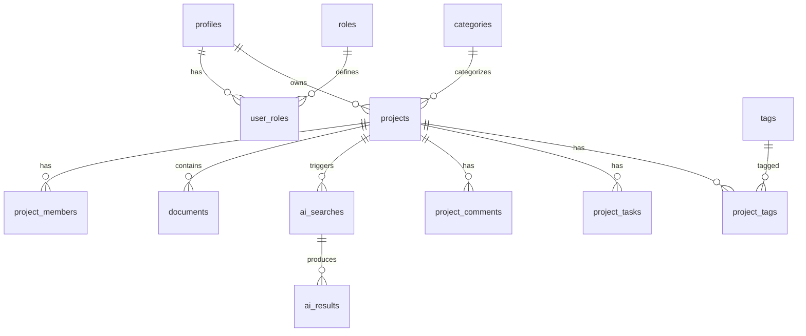

# Référence schéma PostgreSQL

## Diagramme relationnel (simplifié)



## Tables

### `profiles`
| Colonne | Type | Notes |
|---------|------|-------|
| id | UUID PK | = `auth.users.id` |
| email | TEXT | |
| full_name, avatar_url, company, phone, bio, job_title | TEXT | |
| onboarding_completed | BOOLEAN | |
| metadata | JSONB | |
| last_seen_at, created_at, updated_at | TIMESTAMPTZ | |

### `roles` / `user_roles`
- `roles.role_name` : `project_holder` \| `cpi_advisor` \| `expert` \| `admin`
- `user_roles.is_primary` : rôle par défaut après login (unique par user)

### `projects`
| Colonne | Type | Notes |
|---------|------|-------|
| status | project_status | draft → closed |
| visibility | project_visibility | private, team, internal |
| owner_id, assigned_to, expert_id | UUID FK | |
| reference_code | TEXT UNIQUE | Auto PRJ-XXXXXXXX |
| invention_summary, need_description | TEXT | |
| metadata | JSONB | |

### `project_members`
- `member_role` : owner, cpi_advisor, expert, viewer
- `can_edit`, `can_comment`, `can_upload`

### `documents` / `document_versions`
- `file_path` + `bucket_id` (Storage)
- `status` : uploading → active → archived/deleted
- Versions historisées dans `document_versions`

### `ai_searches` / `ai_results`
- Prêt pour workers IA (`status`: pending → processing → completed)
- `search_type` : novelty, semantic, similarity, summarization, etc.
- `payload` JSONB dans `ai_results`

### `audit_logs`
- `action` : create, update, delete, export, validate, search, …
- `entity_type` + `entity_id` + `project_id` optionnel

## Fonctions helpers (RLS)

| Fonction | Usage |
|----------|--------|
| `is_admin()` | Accès global admin |
| `has_role(app_role)` | Vérification rôle |
| `can_view_project(uuid)` | SELECT projets / enfants |
| `can_edit_project(uuid)` | UPDATE projet |
| `can_upload_to_project(uuid)` | Documents + Storage |
| `is_project_cpi(uuid)` | Espace conseiller |
| `is_project_expert(uuid)` | Espace expert |
| `write_audit_log(...)` | INSERT audit sécurisé |

## Storage

| Bucket | Policy SELECT | Policy INSERT |
|--------|---------------|---------------|
| project-documents | Membre / assigné / admin | `{project_id}/{uid}/...` + can_upload |
| avatars | Soi, admin, collaborateurs projet | `{uid}/...` uniquement |

## Workflow métier (états projet)

```
draft → submitted → in_review → awaiting_documents
  → expert_review → cpi_review → approved | rejected → closed
```

## Index principaux

- `projects(owner_id, status, last_activity_at)`
- `project_members(project_id, user_id)`
- `documents(project_id, is_latest)`
- `notifications(user_id, is_read)`
- `audit_logs(created_at DESC)`
